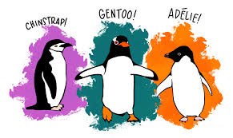
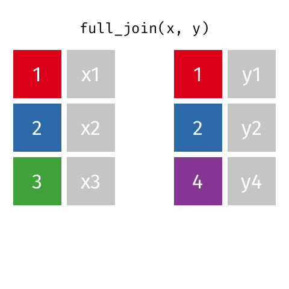
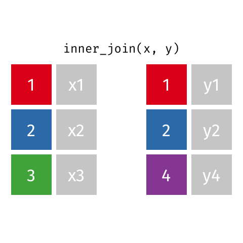
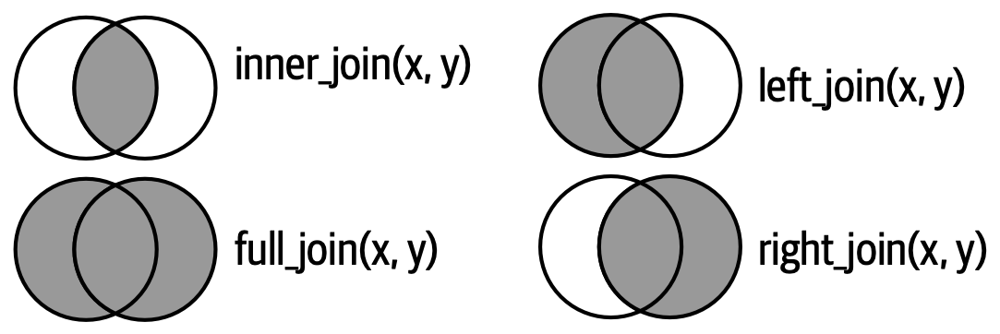

# Programación en TIG - Máster en TIG

---
title: "Tema 3 - Flujo y Control"
author: "Paloma Ruiz Benito y Verónica Cruz Alonso"
date: "2025-11-04"
format:
  html:
    code-copy: true
---

```{r setup, include = FALSE}
knitr::opts_chunk$set(echo = TRUE, warning = FALSE, message = FALSE, include = TRUE)
```

## Objetivos Tema3: Flujo y control

-   Organizando datos: gramática de datos (📝)

-   Visualización de datos: ggplot (🧑‍🎓 )

-   Quarto.

### Gramática de datos

En el tema anterior trabajamos con las funciones *filter* y *select*. En este tema vamos a trabajar con el resto de funciones básicas de *dplyr*.

*select*: selecciona columnas por el nombre

*arrange*: ordena filas.

*slice*: selecciona filas usando índices.

*filter*: selecciona filas que cumplen un criterio.

*distinct*: filtra por filas únicas.

*mutate*: operaciones con variables, añadiendo nuevas.

*summarise*: reduce variables a valores (estadísticas).

*group_by*: operaciones que requieren agrupación.

Siempre vamos a trabajar con la pipa, y el primer argumento será una base de datos. Después tenemos que saber las operaciones *qué queremos hacer*, para obtener una determinada base de datos de *salida*. Para todo el trabajo en esta sesión vamos a trabajar con la base de datos *palmerpenguins* que está disponible en el paquete palmerpenguins.

*¿Qué contiene?* Datos sobre tres especies de pingüinos (Adelie, Chinstrap y Gentoo) de las islas Palmer. Fue creasdo por Dr. Kristen Foram, Dr. Allinson Horst y Dr. Alison Hill, para exploración y visualización de datos. 



Artwork by @allison_horst. 


```{r}
library(palmerpenguins)
library(tidyverse)
glimpse(penguins)

```

## 3.1. Trabajando con un único data frame ####

Selecciona la variable especies, aquellas que empiecen por "bill" y el sexo. 


```{r}
penguins |>
   select(species, starts_with("bill_length_mm"), sex)
```

Hay una serie de funciones que pueden ayudar a seleccionar (ver en el power point), posteriormente lo disponemos en **orden desdencente** por la produndidad del pico.


```{r}
penguins |>
  select(species, bill_depth_mm, sex) |>
  arrange(desc(bill_depth_mm)) |>
  head()
```


Si en vez de *ver* las seis primeras filas, queremos **seleccionarlas**, podemos usar la función *slice* que selecciona filas basads en su posición. El uso de *slice* es más común en tidyverse y especialmente después de agrupar.

```{r}
penguins |>
  select(species, bill_depth_mm, sex) |>
  arrange(desc(bill_depth_mm)) |>
  slice(1:6)
```

En este caso no hay ninguna diferencia con el anterior, pero si quisieramos las **tres primeras filas de cada especie** podriamos hacer lo siguiente. Hay variaciones muy interesantes como tenéis en el power point asociado. 

```{r}
penguins |>
  select(species, bill_depth_mm, sex) |>
  group_by(species)|>
  arrange(desc(bill_depth_mm)) |>
  slice(1:3)
```

Imaginate que en este caso queremos únicamente tener dos especies de las tres. En este caso podemos filtrar por múltiples condiciones:

```{r}
penguins |>
  select(species, bill_depth_mm, sex) |>
  filter(species %in% c("Adelie", "Gentoo"),
         sex == "female") |>
  group_by(species)|>
  arrange(desc(bill_depth_mm)) |>
  slice(1:3)
```


Vamos a ver cómo **contar** el número de individuos muestreados, con la funcion "count" 

```{r}
penguins |>
  select(species, bill_depth_mm, sex) |>
  filter(species %in% c("Adelie", "Gentoo"),
         sex == "female") |>
  group_by(species)|>
  count()
```

Ahora, vamos a calcular la **media del tamaño del pico y la desviación estandar por especie**, añadiendolo a lo anterior con la función summarise(). Por favor, chequea que entiendes cómo **summarise** cambia la estructura del data.frame ya que colapsa las filas a cada valor dentro del "group_by" y remueve las columnas que son irrelevantes en el cálculo. Cuando se genera una nueva columna no es obligatorio pero es *MUY RECOMENDABLE* nombrarla con un estilo y sintaxis adecuado. 

```{r}
penguins |>
  select(species, bill_depth_mm, sex) |>
  filter(species %in% c("Adelie", "Gentoo"),
         sex == "female") |>
  group_by(species)|>
  summarise(num_inds   = n(),
            mean_depth = mean(bill_depth_mm),
            sd_depth   = sd(bill_depth_mm)) 
```

## Ejercicio 3.1: calcula estadisticas y ordena 🧩

Realiza las siguientes pasis:

(1) Para cada especie calcula el numero de individuos hembras y machos con la función table. 

(2) Exporta la tabla en la carpeta "resultados" nombrando a la tabla como "3.1.summary_spp_sex.csv". 

(3) Para los machos y hembras calcula la media, el maximo, el mínimo y la desviación estandar del largo del pico. 

(4) Re-escribe el mismo archivo, de forma que incluya el número de machos y hembras para cada especie, y las estadísicas solicitadas en el punto (2).

(5) Selecciona el data.frame penguins, y calcula con mutate dos nuevas variables que son la longitud y la profundidad del pico en metros. Guardalo en el df penguins. Repite los pasos del (1) al (4). Sintentiza los resultados y las principales especies por macho y hembra.

## 3.2. Trabajando con un varios data frames: bases de datos y uniones ####

Imaginate que tenemos información adicional sobre las especies, pero solo a nivel de especie, que es *la edad promedio de reproducción* y queremos traerlo a este data.frame ¿cómo podríamos unir ambas bases de datos?

Antes de ponder realizar uniones tienes que poder entender qué es un identificador o **llave** tal y como se usa en el lenguaje de base de datos. Normalmente se trabajan con bases de datos que son un conjunto de tablas que se *relacionan* entre si. Cuando trabajes con datos tienes que entender cada **tabla** y como son las relaciones entre las tablas, para poder hacer uniones cuando lo necesites. Cada tabla tiene que tener un **identificador único** y si en tu base de datos tienes varias tablas que se relacionan entre si debes conocer y chequear las relaciones.


```{r}
edad_repro <- data.frame(
  species = c("Adelie", "Chinstrap", "Gentoo"),
  edad_reproduccion = c(3.5, 4.0, 5.0)
)
```

Unimos ambas bases de datos:

```{r}
penguins_joined <- penguins |>
  left_join(edad_repro, by = "species")
```

Inspeccionamos el resultado: 

```{r}
penguins_joined |>
  select(species, sex, body_mass_g, edad_reproduccion) |>
  head()
```

Como resultado el **left_join** mantiene todas las filas de la izquiera, pero _¿habría dado el mismo resultado con un right_join o full_join?_


Si hubieramos hecho un *right join* no hubiera sido el mismo resultado... Además, tenemos que considerar cual es el "identificador" de cada base de datos.


En ocasiones nos puede interesar realizar uniones completas con **full_join**, en ese caso se mantendrían todas las filas de ambas bases de datos, poniendo NAs si no tiene información disponible. 




También podríamos hacer un **inner_join** si queremos que mantenga únicamente los identificadores que están en ambas bases de datos.




A modo resumen, aquí tienes **todos los tipos de uniones**.



Os mostramos en línea para practicar manipulación y transformación de datos en R, especialmente con el **ecosistema tidyverse**.  Cada enlace incluye ejercicios, datasets y explicaciones paso a paso.

---

### [R for Data Science (Capítulo 3: Data transformation)](https://r4ds.hadley.nz/data-transform.html)
Guía oficial del libro *R for Data Science* (2ª edición).  
Incluye ejemplos detallados sobre los verbos principales de `dplyr`:  
`filter()`, `mutate()`, `arrange()`, `summarise()`, `group_by()` y `join()`.

---

### [Learn the tidyverse – sitio oficial](https://www.tidyverse.org/learn/)
Portal oficial del *tidyverse*, con tutoriales, documentación y materiales de aprendizaje.  
Ofrece enlaces a recursos de `dplyr`, `ggplot2`, `tidyr`, `stringr`, `forcats`, etc.

---

### [Interactive Tutorials • learnr](https://rstudio.github.io/learnr/)
Herramienta para crear y realizar **tutoriales interactivos** ejecutables dentro de RStudio.  

---

###[TidyTuesday – práctica libre con datos reales](https://github.com/rfordatascience/tidytuesday?tab=readme-ov-file)
Proyecto abierto con **datasets semanales**. Permite practicar todo el flujo tidyverse.

