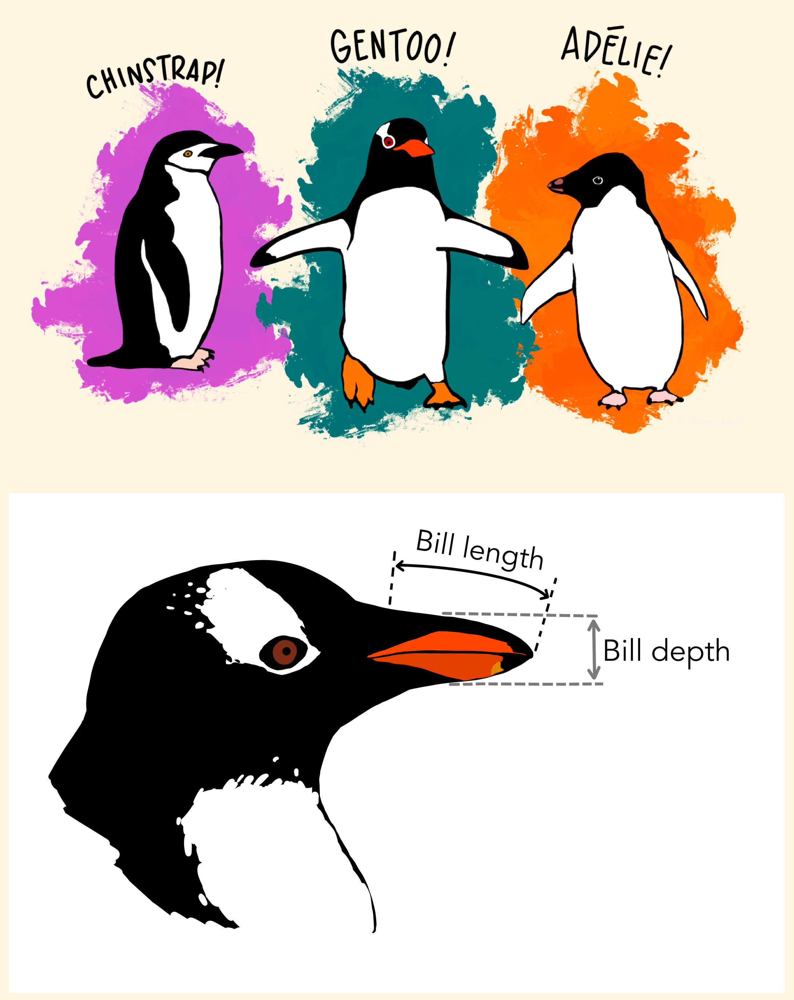

# Programación en TIG - Máster en TIG

---
title: "Tema 3 - Flujo y Control"
author: "Paloma Ruiz Benito y Verónica Cruz Alonso"
date: "2025-10-14"
format:
  html:
    code-copy: true
---

```{r setup, include = FALSE}
knitr::opts_chunk$set(echo = TRUE, warning = FALSE, message = FALSE, include = TRUE)
```

## Objetivos Tema3: Flujo y control

-   Organizando datos: gramática de datos (📝)

-   Visualización de datos: ggplot (🧑‍🎓 )

-   Quarto.

### 1. Los básicos: datos y la estética del gráfico.

Vamos a seguir trabajando con los datos de Palmer Penguins. Donde tenemos las medidas de especies de pinguimos de la Isla de Palmer.


```{r}
library(palmerpenguins)
library(tidyverse)
library(GGally)
glimpse(penguins)

```


Ahora vamos a realizar un gráfico de dispersión que relacione el ancho y la profundidad del pico, y que meustre distintos colores para las especies


```{r}
ggplot(data = penguins, #llama al data.frame con el que vamos a hacer el gráfico
       mapping = aes(x = bill_depth_mm, y = bill_length_mm, #determina la x e y
                     colour = species)) + #pone las especies
  geom_point() + #hace un gráfico de dispersión de puntos
  labs(title = "Profundidad y longitud del pico",
       subtitle = "Dimensiones para pingüinos Adelie, Chinstrap, and Gentoo",
       x = "Profundidad (mm)", y = "Longitud (mm)",
       colour = "especies") +
  scale_colour_viridis_d() #pone escalas de color

```

**¿Qué tipo de relación hay entre la longitud y la produndidad del pico?**



Dentro de **aesthetics** podemos determinar todas las caracteristicas específicas de una determinada variable como el color, la forma, el tamaño o la transparencia (`alpha`).


### Ejercicio 1: Penguins, gráficos de dispersión 🧩

Si puedes haz el mismo gráfico, pero sin diferenciar colores para cada especie y guardalo en la carpeta de resutlados. Dentro de el argumento aes() prueba a poner el color azul con transparecnia, la forma de triangulo y que el tamaño dependa del peso del pinguino. Después prueba a hacer un segundo gráfico donde la forma o `shape` dependa de la isla a la que pertenece. 

**💡Consejo: Usa la chuleta de ggplot2 para los ejercicios**

Ejercicio avanzado: calcula la corelación entre la profundidad y el largo del pico para cada especie.

### 2. Los básicos: la estética vs. el mapeado, facetas.

El **mapping** determina el tamaño, la transparenciad e los puntos basados en los valores de la variable especificada, y lo especificamos dentro del argumento `aes()`.

El **setting** determina el tamaño, la transparencia, etc. sin basarse en los valores de la variable especificada. EN este caso va en la función `geom_poing` (pero puede ser del tipo `geom_*()` porque aprenderemos más formas a lo largo de la visualización).

Las **facetas** son gráficos más pequeños que meustran distintos subconjuntos de los datos. Son muy adecuados para poder ver relaciones condicionales en grandes bases de datos.

```{r}
ggplot(penguins, aes(x = bill_depth_mm, y = bill_length_mm)) + 
  geom_point() +
  facet_grid(species ~ sex)
```

En el siguiente código lo mostramos sólo para las especies.

```{r}
ggplot(penguins, aes(x = bill_depth_mm, y = bill_length_mm)) + 
  geom_point() +
  facet_wrap(~ species )
```


```{r}
ggplot(
  penguins, 
  aes(x = bill_depth_mm, 
      y = bill_length_mm, 
      color = species)) +
  geom_point() +
  facet_grid(species ~ sex) +
  scale_color_viridis_d()
```

### 3. Visualización de datos numericos: univariante.

Para visualizar datos numericos en múltiples ocasiones estamos interesados en la **forma** (si está sesgado o es simétrico, si es unimodal, etc.), medidas de la **centralidad** de los datos (media, mediana, moda), o de **variabilidad** de lo datos (rango, desviación estandar, rango intercuartilico), así como en conocer **datos anómalos**. 

Para ello vamos a aprender a hacer gráficos básicos con esta información. Empezamos por el **histograma**.

```{r}
ggplot(penguins, 
  aes(bill_depth_mm)) +
  geom_histogram()
```


Este gráfico se debe mejorar, poniendo los ejes de una manera adecuada, etc.

```{r}
ggplot(penguins, 
  aes(bill_depth_mm,
      fill = species)) +
  geom_histogram(alpha = 0.5) +
   labs(
    x = "Profundidad (mm)",
    y = "Frequency"
  )
```
No es muy sencillo de comparar, por lo que podríamos usar las facetas.

```{r}
ggplot(penguins, 
  aes(bill_depth_mm,
      fill = species)) +
  geom_histogram(alpha = 0.5) +
   labs(
    x = "Profundidad (mm)",
    y = "Frequency"
  ) +
  facet_wrap(~ species, nrow = 3)
```

### Ejercicio 2: trabajando con relaciones univariantes.

Por favor, repite el ejercicio anterior haciendo un gráfico de densiad con `geom_density` y un gráfico de cajas y bigotes con `geom_boxplot`. 

### 3. Visualización de datos numericos: bivariante.

Además de los gráficos de dispersión, se pueden hacer otro tipos de gráficos que muestran la relación entre dos variables:

```{r}
ggplot(penguins, aes(x = bill_depth_mm, y = bill_length_mm)) + 
  geom_hex() 
```

Además, podríamos ver la relación entre dos variables, por ejemplo, incluyendo una linea. Esta información está sacada de (aquí)[https://allisonhorst.github.io/palmerpenguins/articles/examples.html] 

```{r}
bill_len_dep <- ggplot(data = penguins,
                         aes(x = bill_length_mm,
                             y = bill_depth_mm,
                             group = species)) +
  geom_point(aes(color = species, 
                 shape = species),
             size = 3,
             alpha = 0.8) +
  geom_smooth(method = "lm", se = FALSE, aes(color = species)) +
  scale_color_manual(values = c("darkorange","purple","cyan4")) +
  labs(x = "Longitud (mm)",
       y = "Produndidad (mm)",
       color = "Especies de pingüino",
       shape = "Especies de pingüino") +
  theme(legend.position = c(0.85, 0.15),
        plot.title.position = "plot",
        plot.caption = element_text(hjust = 0, face= "italic"),
        plot.caption.position = "plot")

bill_len_dep

```

Además, si omitieramos la información a nivel de especie podríamos encontrarnos ante la paradoja de Simpson.

```{r}
bill_no_species <- ggplot(data = penguins,
                         aes(x = bill_length_mm,
                             y = bill_depth_mm)) +
  geom_point() +
  labs( x = "Longitud (mm)",
       y = "Profundidad (mm)") +
  theme(plot.title.position = "plot",
        plot.caption = element_text(hjust = 0, face= "italic"),
        plot.caption.position = "plot") +
  geom_smooth(method = "lm", se = FALSE, color = "gray50")

bill_no_species
```
### 3. Visualización de datos categóricos

```{r}

ggplot(penguins, aes(x = species, fill = sex)) +
  geom_bar() 
```

En vez de la cuenta (o número total), se puede hacer que llegue al 100% si lo que queemos es comparar si hay más machos que hembras:

```{r}
ggplot(penguins, aes(x = species, fill = sex)) +
  geom_bar(position = "fill") 
```
### 3. Relaciones multivariantes

Ahora vamos a ver correlaciones y relaciones entre variables.

```{r}

library(GGally)

penguins|>
  select(species, body_mass_g, ends_with("_mm")) |> 
  GGally::ggpairs(aes(color = species),
          columns = c("flipper_length_mm", "body_mass_g", 
                      "bill_length_mm", "bill_depth_mm")) +
  scale_colour_manual(values = c("darkorange","purple","cyan4")) +
  scale_fill_manual(values = c("darkorange","purple","cyan4"))
```

Puedes encontrar muchos ejemplos buenos de visualización de datos.
https://r4ds.had.co.nz/data-visualisation.html 