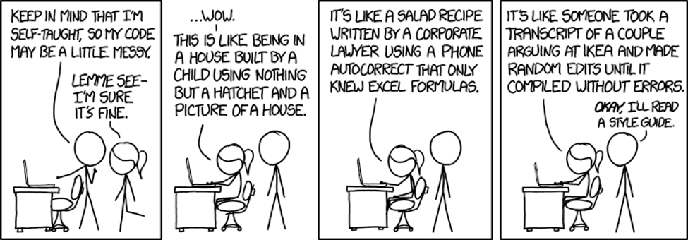
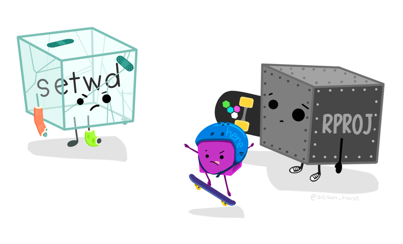
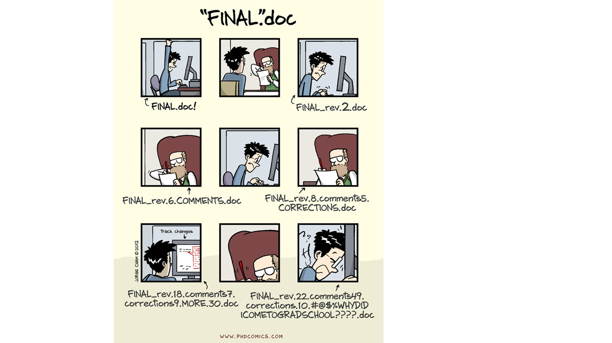
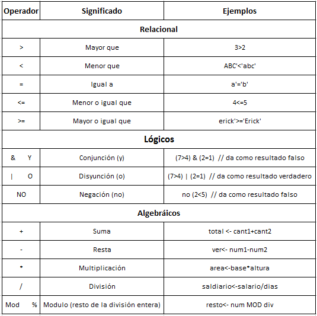
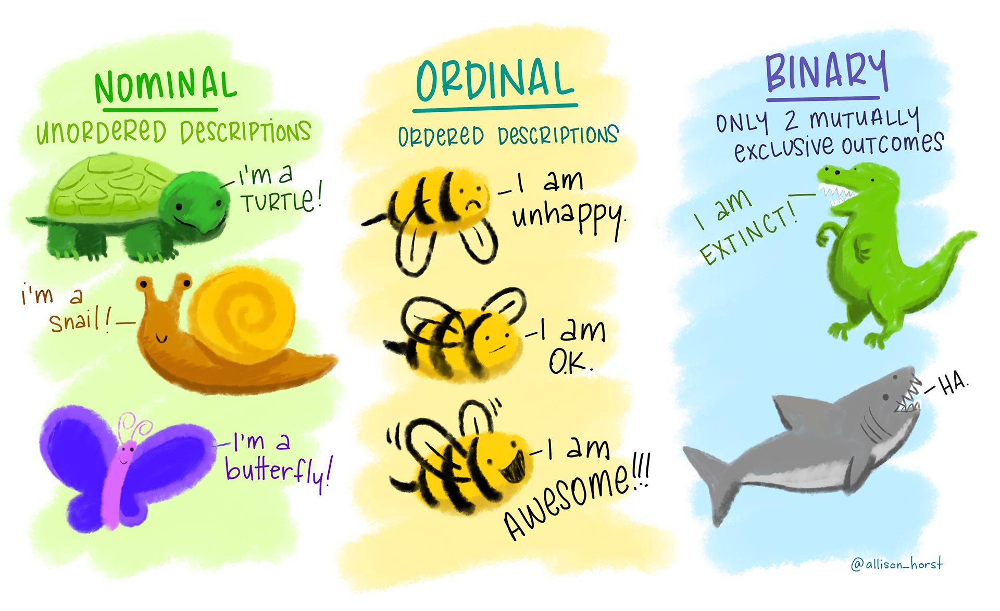
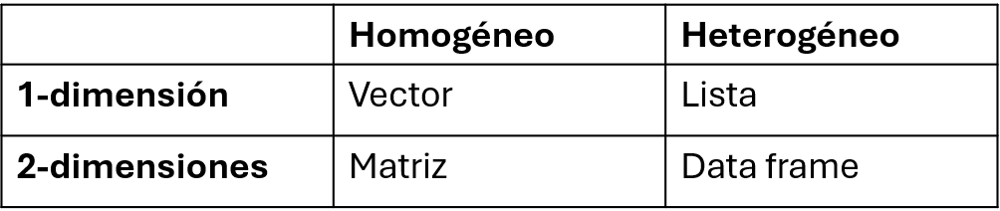
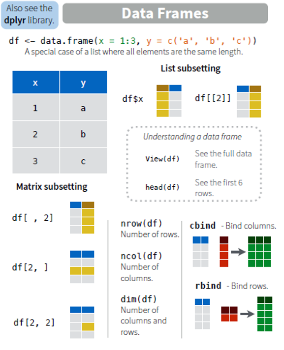
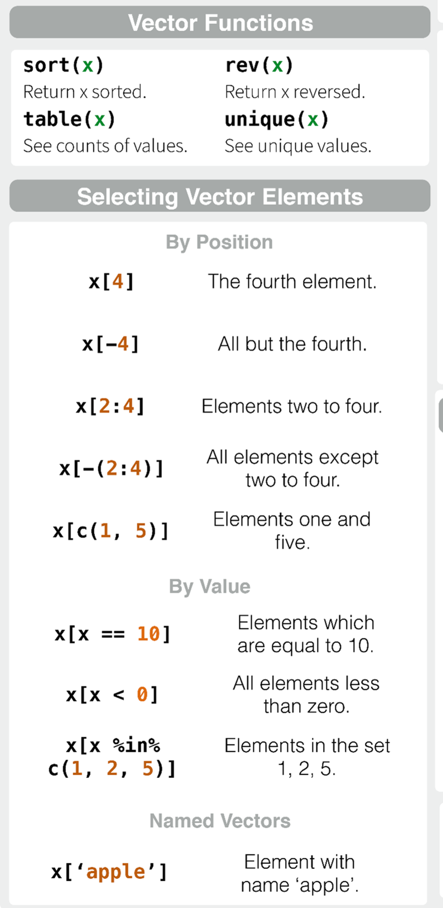
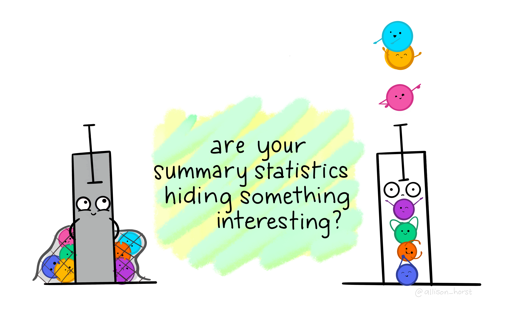

{width="32%"}

# Código de conducta: ¿como aplicarlo a la asignatura?

Antes de empezar. Estamos de acuerdo con el código ético y hacemos un ejemplo de este curso: <https://www.contributor-covenant.org/version/2/0/code_of_conduct/> e información sacada de <https://datasciencebox.org/> Discute con tu compañero los puntos clave en tu trabajo profesional


# Comenzando a trabajar en R: los básicos

🎯 **Objetos:** cualquier elemento almacenado con un nombre específico (`<-`). Pueden ser de muchas clases: `numeric`, `integer`, `logical`, `data.frame`, `SpatVector`, etc.

El operador ":" genera un grupo de números enteros:

`{r}  1:6  #El operador ":" genera un grupo de números enteros c(1, 2, 3, 4, 5, 6) #La función c() concatena}`

Ahora mismo hemos generado un grupo de seis número de enteros, pero no se han guardado en ningún sitio en la memoria del ordenador. Si quieres usar este vector de nuevo, debes guardarlo, creando un objeto en R, para ello debes usar la flecha de asignación \<-.

`{r}  mi_vector <- 1:6 #con la flecha de asignación lo guardo como un objeto R mi_vector <- c(1, 2, 3, 4, 5, 6) #pero no lo tengo guardado en mi carpeta str(mi_vector) #podemos ver la estructura del vector class(mi_vector) summary(mi_vector) #y unas estadisticas básicas}`

🎯 **Funciones:** objetos de R que toman un vector de entrada y dan como resultado otro vector haciendo una acción concreta (funcionalidad específica). Son los bloques de construcción fundamentales en cualquier script de R que es un lenguaje funcional.

🎯 **Argumentos:** son las especificaciones de las funciones. Tienen un nombre y un valor por defecto o indicado por el usuario.

🎯 **Paquetes o librerias:** contienen funciones reutilizables, documentación sobre cómo usarlas y datos de ejemplo. Son las unidades fundamentales de código reproducible en R.

> Para comprender la programación en R, resultan útiles dos lemas:
>
> \- Todo lo que existe es un objeto.
>
> \- Todo lo que sucede es una llamada a función.
>
> — John Chambers ([Advanced R](https://adv-r.hadley.nz/index.html))


🎯 [**CRAN**](https://cran.r-project.org/)**:** the Comprehensive R Archive Network. A 26 de septiembre de 2026, CRAN ofrecía 25.205 paquetes ([cran.r-project.org](https://cran.r-project.org/web/packages/?utm_source=chatgpt.com)). Es la cifra de paquetes disponibles en CRAN, no un total de todos los repositorios de R. Para orientarse entre ellos, CRAN mantiene 49 guías temáticas (*Task Views*) para encontrar paquetes. Incluyen, por ejemplo, análisis espacial y espaciotemporal, datos ambientales, estadística, series temporales, aprendizaje automático, visualización, bases de datos e investigación reproducible. No son categorías excluyentes.

# ¿Cómo consigo que mi código se entienda?



En esta asignatura trataremos de seguir la [Guia de estilo de Tidyverse](https://style.tidyverse.org/). No es obligatorio usar este estilo, pero hay facilitar la lectura a otros usuarios utilizando un estilo común y consistente.

## Consejo 1: Trabaja por proyectos e instala los paquetes necesarios una vez

El **directorio de trabajo** es la carpeta de nuestro ordenador donde estamos trabajando, de donde se leeran los archivos de entrada y donde se guardarán los de salida a menos que especifiquemos lo contrario. El *script* es el archivo básico que almacena código de R de nuestra sesión de trabajo.

```{r wd} #| eval: false}
getwd() # saber directorio de trabajo    
# setwd("C:\\Users\\uah\\OneDrive - Universidad de Alcala\\GitHub_Projects\\programacionR-masterTIG")  
# ojo con la ruta / o \\
```

💡 Para ejecutar un comando: `Ctrl + Enter (Ctrl + R)` en el editor de código; `Enter` en la consola.

No es recomendable establecer el directorio de trabajo manualmente (código anterior) porque el trabajo deja de ser reproducible. Es mejor crear desde el principio un **proyecto** en R ligado a un **directorio relativo** que contenga todos los datos de entrada, los *scripts* y los resultados del *script*. Al abrir el proyecto, el directorio se sincroniza con pestaña *Files*.

💡Para crear un proyecto: Archivo \> Nuevo proyecto

Es muy importante ENTENDER las ventajas de trabajar por proyectos, [aquí](https://support.posit.co/hc/en-us/articles/200526207-Using-RStudio-Projects) podéis ver más información.

Cuando trabajes en R revisa la **configuración del código** en optiones globales. En el "código" las secciones de "1.3.1 Edición, 1.3.2 Visualización, 1.3.3 Guardado, 1.3.4 Autocompletado , y 1.3.5 Diagnósticos" pueden ser relevantes.

Idealmente **todos los archivos de trabajo** deben estar en la misma carpeta dividiendo datos, analisis, resultados, etc. (aunque el jueves veremos algunas excepciones). Los datos con los que trabajamos deben estar adecuadamente documentados (metadatos, con una descripción de variables y unidades, autoría, etc.) y debemos conocer las relaciones entre las tablas con las que trabajamos (bases de datos relacionales).

💡Es recomendable abrir RStudio utilizando el icono del proyecto para una mejor organización.

———————————————————————————————————

#### 📝 Ejercicio

1.  Crea un proyecto para la asignatura de programación TIG.

👀Evita símbolos raros (espacios, tildes, etc.) en la ruta de trabajo.

2.  Una vez creado genera una carpeta de "scripts", una de "datos" y una de "resultados". Revisa qué ha pasado en tu panel de archivos de RStudio. Revisa en tu panel de Rstudio a la derecha, abajo, que archivos tienes. ¿Cómo has nombrado tu archivo de trabajo actual? ¡Revisa y cambia el nombre al final de la sesión!

    Normalmente, para trabajar adecuadamente debemos organizar las carpetas y los nombres de los archivos con los que trabajamos ¿Cómo lo hacéis habitualmente?

———————————————————————————————————

{width="427"}

[Imagen de Allson Horst](https://allisonhorst.com/everything-else)

💡RStudio guarda por defecto los *scripts* abiertos y los datos cargados de una sesión a otra. Si quieres abrir una sesión limpia cada vez te recomendamos desactivar que se guarde el ***.RData*** en el espacio de trabajo.

{width="65%"}

### Instalar y cargar paquetes

La primera vez que necesitas un paquete o librería lo instalas con la función `install.packages()`; las veces subsecuentes lo cargas en tu sesión de trabajo con la función `library()` para poder usarlo.

```{r instalar}
# install.packages("tidyverse", dep = T) 
# dep = T significa instalar dependencias   
#library(tidyverse)   
```

———————————————————————————————————

#### 📝 Ejercicio

Instala el metapaquete tidyverse utilizando la consola y cárgalo en tu ambiente de trabajo.

———————————————————————————————————

### Organización del *script*

Es recomendable organizar el script siempre de la misma manera: cargar paquetes, leer los datos, analizar, guardar resultados.

Conviene utilizar secciones `(CTRL + SHIFT + R)`.

Numerar los scripts y las salidas (tablas, figuras, etc.) ayuda a ordenar el flujo de trabajo.

Conviene comentar el script con `#`. No es tan importante contar qué estás haciendo porque ya se entiene al leer el código, si no **por qué** has ido haciendo cada paso.

———————————————————————————————————

#### 📝 Ejercicio

Discute en parejas cuando usar un script nuevo o secciones dentro de un mismo script.

———————————————————————————————————

## Consejo 2: Usa teclas rápidas y documenta tu código

*¡En este curso debes usar las TECLAS RÁPIDAS para programar!*

Utiliza **comentarios** para guiar al lector con `#`, acordarte por qué hiciste un determinado código, o ayudar a otra persona a entender tu código sin necesitar que tu se lo expliques (o a ti mismo dentro de un tiempo...) ¡un código buen comentado te ahorrará mucho tiempo! Además, te aconsejamos usar un **código modular**, partiendo un script en varios pequeños o escribiendo funciones con un cometido específico (evitando repeticiones de código).

💡 Para ejecutar una línea de código usa el comando: *Ctrl + Enter (Ctrl + R)*

*¡No tienes que seleccionar con el ratón la línea de ejecutar y darle a "Run"! con las techas de más arriba e incluso shift te ahorrara tiempo!*

| Atajo | Efecto |
|----|----|
| Ctrl + Z | Deshacer |
| Ctrl + Shift + Z | Rehacer (no es la convención habitual) |
| Ctrl + O | Abrir archivo |
| Ctrl + A | Seleccionar todo |
| Ctrl + S | Guardar archivo |
| Ctrl + F | Buscar en el archivo actual |
| Ctrl + Shift + F | Buscar en varios archivos |
| Ctrl + W | Cerrar pestaña |
| Ctrl + Tab | Ir a la siguiente pestaña |
| Ctrl + Q | Salir de RStudio |
| Tab | Indentar / Autocompletado |
| Shift + Tab | Quitar indentación |
| Ctrl + Shift + F10 | Reiniciar la sesión de R (¡conviene hacerlo a menudo!) |
| Ctrl + Shift + H | Elegir directorio de trabajo (no necesario si trabajas en un proyecto de R 😉) |
| Ctrl + F7 | Añadir una nueva columna de código (se elimina cerrando todas sus pestañas con Ctrl + W) |

## Consejo 3: Aprende a pedir ayuda, conoce las funciones y argumentos

Dentro de los paquetes puedes pedir ayuda de multiples maneras. En [este](https://www.revistaecosistemas.net/index.php/ecosistemas/article/view/1880/1242) trabajo puedes leer "por qué escribir funciones en R", y la respuesta es sencilla: proque todo se basa en funciones en R. Cuando trabajes con una función debes comprender sus argumentos (elementros de entrada de la función), el funcionamiento (qué hace la función) y la salida.

———————————————————————————————————

#### 📝 Ejercicio: busca ayuda

¿Puedes buscar ayuda sobre qué es el paquete ggplot2 y comprobar qué hace? ¿Puedes buscar ayuda sobre la función "select"?

```{r ayuda}
??ggplot2 
?select
```

———————————————————————————————————

Si no encuentras el problema y necesitas ayuda puedes encontrarla en: \[Stackoverflow\](<http://stackoverflow.com)> y R-help mailing list. Antes de escribir:

-   Asegurate de tener la última version de R y del paquete instalada.

-   Mira si alguien ha preguntado previamente sobre tu problema, es mucho más rápido que esperar una respuesta.

-   Crea un ejemplo minimo y reproducible para que la comunidad pueda ayudarte con [reprex](https://reprex.tidyverse.org/)[.](http://stackoverflow.com/questions/5963269).)

## Consejo 4: Nombrar objetos y archivos adecuadamente

Al asignar un nombre a un objeto podemos llamarlos siempre que necesitemos a lo largo del script. No es necesario guardar (exportar) la mayoría de los objetos que tenemos en el entorno de trabajo de R a nuestro ordenador, lo importante es conservar el *script* con el que se generan.

———————————————————————————————————

#### 📝 Ejercicio: nombra objetos

¿Es lo mismo nombrar a un objeto "x" o "X"? ¿Crees que te puede dar problemas en el código nombrar variables con mayúsculas y minúsculas? Para verlo, nombra dos objetos.

```{r objetos}

x <- 4.5 
X <- "objeto" # si el objeto contiene letras, usar comillas 
class(x) # función para ver de que clase es nuestro objeto 
```

———————————————————————————————————

📝R es sensible a las mayúsculas. **¡¡¡Mejor no usarlas!!!**

📝Los nombre de los objetos deben ser **descriptivos** y no deben contener símbolos especiales. Es mejor usar nombres largos pero descriptivos, que cortos o sin sentido.

💡 Excepción: para archivos temporales yo generalmente uso "kk" que me recuerda a recordar que este archivo es temporal y prescindible...



Hay dos cosas difíciles en la ciencia de computación:

> \- Invalidar cachés.
>
> \- Poner nombres a cosas
>
> — Phil Karlton

📝 Usa nombre memorables y correctos para tus variables:

-   ✅ Siempre empiezan por letras (en el caso de objetos)

-   ✅ Mejor que sólo contengan letras, numeros, "\_" y ".".

-   ✅ Los nombres deben ser legibles por máquinas: no uses espacios, caracteres especiales o palabras o símbolos reservadas para otras cosas (`^`, `!`, `$`, `@`, `+`, `-`, `/`, `*`).

-   ✅ Los nombres deben ser legibles para humanos: describen lo que continene. Para variables usa nombres y para funciones verbos.

-   ✅ Mejor minúsculas separadas por "\_"

-   ✅ Evita el uso de nombres comunes

💡 Numerar los scripts e incluso las salidas (tablas, figuras, etc.) ayuda a simplificar el orden y trabajar comodamente mediante proyectos.

———————————————————————————————————

### 📝 Ejercicio: guia de estilo

Lee la **guía de estilo** de tidyverse (con la que trabajaremos en el curso):

-   Sección 2.2.: <https://r4ds.hadley.nz/workflow-style.html>

-   Sección 4.1. y 4.2.: <https://style.tidyverse.org/syntax.html>

Revisa cómo nombras a las tablas y las variables con las que trabajas:

-   ¿siguen un buen estilo a la hora de nombrarlas?

-   ¿trabajas en proyectos y tienes todo ordenado adecuadamente

-   ———————————————————————————————————

## Consejo 5: Sintaxis y espaciado

———————————————————————————————————

#### 📝 Ejercicio: sintaxis y estilo en R.

Lee la Guía de estilo de Tidyverse y corrige el siguiente código para que sea más legible por otra persona.

```{r errore_}
#|eval: false


valores <- c(1,2,3)

media <- mean( valores )

total<-1+2

secuencia <- 1 : 10
```

———————————————————————————————————

# Tipos de objetos en R aplicados a las TIG

En R, el código que tecleas se llama **comando**. La interfaz de Rstudio es sencilla, cuando en el ***prompt*** de la consola de RStudio ejecutas una línea de comando da instrucciones al ordenador para hacer la operación escrita. Puedes usar R como una calculadora, usando operadores matemáticos, relacionales o lógicos, que son:



```{r aritmetica}
5 + 6 
5 * 6 
60 / 4 
5 + 4 - 2 
5 + 4 * 5 
(5 + 4) * 5 
log(10) # logaritmo neperiano  
log10(10)  
exp(1)  
3 ^ 2  
3 ^ 2 / 3  
sqrt(16)  
pi  
sin(pi / 2) # en radianes  cos(pi / 2) 
tan(pi / 2) 
asin(1) * 2 
acos(1)
```

## Tipos de objetos

## Vectores

🎯 Un **vector** es la estructura de datos más simple en R. Es una colección de uno o más elementos del mismo tipo (números -continuos o discretos-, texto o valores lógicos).

Los vectores pueden estar vacíos (tener una longiturd de 0) y esto puede ser útil cuando escribáis funciones.

*¿Qué tipos de datos puede contener un vector?*

```{r vectores}
# Vector con coordenadas de latitud
latitud <- c(41.4, 42.1, 40.9, 39.5) 
latitud 

# Vector con valores de severidad de incendios (de 0 a 1000)
severidad_incendios <- c(110, 450, 440, 200)
severidad_incendios 

# Podemos operar con ellos
severidad_incendios + 10       # sumar 10 a todas las everidades
severidad_incendios * 0.001    # convertir a 0-1
mean(severidad_incendios)      # promedio de severidades
max(severidad_incendios)       # severidad máxima

# Tipo de los vectores creados
str(latitud)
length(latitud)
severidad_incendios_int <- as.integer(c(110, 450, 440, 200))
str(severidad_incendios_int)
```

Variables continuas y discretas. [Imagen de Allison Horst](https://allisonhorst.com/everything-else)

Si tu dato es numerico, puede ser discreto (int) o continue (num)

———————————————————————————————————

#### 📝 Ejercicio: crea y opera con vectores

-   Crea un vector llamado `long` con cuatro valores de longitud de tu elección.

-   Calcula la media y el mínimo de `long`.

-   Suma 0.5 a todos los valores de `long`.

-   ¿Puedes buscar ayuda sobre las funciones rep(), seq(), rnorm() y sample() y generar dos vectores que se relacionen con la base de datos de eventos de incendios hipotetica que estamos creando? 🔎 Usa la chuleta de "r-base"

———————————————————————————————————

```{r sol_vectores}
#| include: false

# longitud <- c(-3.7, -3.6, -3.8, -3.9)
# mean(longitud)
# min(longitud)
# longitud_plus <- longitud + 0.5
```

🧠 *¿Existe algún otro tipo de dato númerico? Busca información sobre otro tipo de dato.*

⚠️ *¿son todos los tipos de datos categóricos iguales?*



Sobre los datos numéricos, o grupos sobre factor se pueden usar funciones básicas como `mean()`, `min()`, `max()`, además de poder realizar las operaciones básicas con vectores.

———————————————————————————————————

#### 📝 Ejercicio: crea y comprende vectores tipo "factor" o "character" o "binario"

-   Crea un vector de sitio tipo character y otro de tipo binario

-   Transforma alguno de ellos a formato "factor"

———————————————————————————————————

## Matrices

🎯 Las **matrices** son estructuras de datos bidimensionales que contienen datos del mismo tipo. En TIG, pueden servir para representar un **raster** (por ejemplo, una matriz de elevaciones o pendientes).

```{r matrices}
# Crear 15 valores de incendios simulados
incendios <- sample(100:500, size = 15, replace = TRUE)

# Transformar a matriz 3 x 4 (3 filas, 4 columnas)
mat_incendios <- matrix(incendios, nrow = 3, ncol = 4)
mat_incendios

# Resumen de la matriz
summary(mat_incendios)
```

———————————————————————————————————

#### 📝 Ejercicio: crea y opera con una matriz

-   Crea una matriz de 5 x 5 de nombre `mat5` con valores aleatorios entre 0 y 1 (piensa en ello como un raster de pendientes).
-   Calcula el valor máximo de esa matriz.
-   ¿Qué celda (fila, columna) tiene el máximo?

———————————————————————————————————

```{r sol_matrices}
#| include: false

# mat5 <- matrix(runif(25, min = 0, max = 1), nrow = 5, ncol = 5) 
# genera números aleatorios con distribución uniforme
# max_val <- max(mat5)
# which(mat5 == max_val, arr.ind = TRUE)  # fila, columna del máximo
```

## *Data frames*

🎯 Un ***data frame*** es una tabla de dos dimensiones donde cada columna puede ser de distinto tipo. Es la estructura más usada para análisis y la que normalmente acompaña a una capa espacial vectorial (atributos).

```{r dataframes}
incendios <- data.frame(
                nombre = c("A", "B", "C", "D"),
                tipo = c("copa", "copa", "superficie", "superficie"),
                latitud = c(41.4, 42.1, 40.9, 39.5), 
                severidad_incendio <- c(110, 450, 440, 200))

incendios
summary(incendios)
```

———————————————————————————————————

#### 📝 Ejercicio: crea un data frame completo.

Crea un *data frame* llamado incendios con todas las variables previas. Cuando trabajamos con un data.frame o cualquier otro objeto, lo primero que debemos conocer es su estructura: número de observaciones o filas, número de columnas o variables, tipo de dato (númerico o carácter, y de qué tipo).

⚠️ Lo siguiente que debemos conocer son las características básicas *¿conoces tus datos?.*

```{r sol_dataframes}
#| include: false

# rios <- data.frame(
#   nombre = c("Rio1", "Rio2", "Rio3"),
#   longitud_km = c(45.2, 120.5, 78.0),
#   caudal_m3s = c(12.3, 45.1, 8.7)
# )
```

———————————————————————————————————

#### 📝🚀 Ejercicio: crea vectores de distinto tipo y únelos en un data frame

La creación de vectores se usa mucho en programación. Revisa en la [chuleta de R base](https://rstudio.github.io/cheatsheets/base-r.pdf) la información para crear vectores y genera todos los siguientes vectores:

-   Genera una secuencia de enteros del 1000 and 1099, poniendole el nombre de *identificador* al objeto.

-   Genera un vector que se llame "*temperatura*" que sea una secuencia de -5 a 15 y tenga una longitud de 100.

-   Haz que se repita "interior" y "costa" en un vector que se llame *region*, repitiendose 50 veces cada valor.

-   Haz que se repita c("1", "0") en un vector que se llame *agente*, repitiendose 50 veces.

-   Haz que se repita c("1", "2", "3", "4") en un vector que se llame *tipo_suelo*, repitiendose 25 veces.

-   Genera un vector que tenga una media de 500 y una desviación de 100, que se llame *precipitacion*.

-   Une todos los vectores en un data frame.

-   *¿Son todos los tipos de datos categóricos iguales?*

———————————————————————————————————

#### 📝🚀 Ejercicio: Siempre responde a estas preguntas básicas de las variable de interéss

-   ¿que rango máximo tienen mis datos? ¿y qué percentiles?¿tengo valores anómalos? ¿por qué?

-   ¿medidas de centralidad (e.g. media, moda, mediana)?

-   ¿y medidas de dispersión (rangos, percentiles, valores anómales, desviación estandar y error estándar?

-   ¿varian por ciertos niveles del factor (e.g. ¿tipo de incendio?).

¿Tienes ceros o valores nulos entus datos? ¿Por qué?

Para responder a estas cuestiones, debes usar funciones estandar como `summary()`, pero también revisa la chulta de rbase. Además, prueba a hacer gráficos sencillos con la función `plot()`.

———————————————————————————————————

## Listas

🎯 Una **lista** puede contener todo tipo de objetos: vectores, matrices, data.frames, modelos, etc. En TIG es muy útil para agrupar varias capas o resultados de un análisis en un único objeto.

```{r listas}
info_tig <- list(
  coords = list(latitud = latitud, longitud = c(-3.7, -3.6, -3.8, -3.9)),
  tipo = c("copa", "copa", "superficie", "superficie"),
  mat_incendios = mat_incendios
)

str(info_tig)
```

———————————————————————————————————

#### 📝 Ejercicio: crea una lista y accede a sus elementos

-   Crea una lista que contenga: tu vector `longitud`, la matriz 5 x 5 `mat5` y el *data frame* `incendios`.

———————————————————————————————————

```{r sol_listas}
#| include: false

# mi_lista <- list(long = c(-3.7, -3.6, -3.8, -3.9), 
#                    pendiente = mat5, rios = rios)
# str(mi_lista)
```

## Resumen

———————————————————————————————————

#### 📝 Ejercicio: tipo de datos

¿Sabes cual es la diferencia entre un vector y una lista?

———————————————————————————————————

Aquí, os dejamos una chuleta del número de dimensiones y tipo de datos en las columnas:

#### {width="346"}

En general, trabajamos con datos rectangulares donde las filas son observaciones y las filas con columnas (volvemos sobre esto en la siguiente sección).

## Indexación (acceder a elementos)

Saber indexar es esencial: permite leer o modificar valores puntuales. Ahora vamos a ver cómo seleccionar e indexar elementos de vectores, data.frames, matrices y listas:

{width="344"}

```{r indexacion}
# Vectores
severidad_incendios
severidad_incendios[2]          # segundo evento

# Matrices: [fila, columna]
mat_incendios
mat_incendios[1, 3]  # fila 1, columna 3
mat_incendios[1, ]   # todas las columnas de la fila 1
mat_incendios[, 2]   # todas las filas de la columna 2

# Data.frame
incendios
incendios[2, "nombre"]   # nombre del municipio "B" del segundo evento
incendios$nombre         # vector de la columna 'nombre'

# Listas
mi_lista <- list(a = 1:4, b = letters[1:4])
mi_lista[[2]]    # segundo elemento (por posición)
mi_lista$b       # elemento por nombre
```

Comprueba con la chuleta de Rbase que sabes seleccionar todos los elementos de un vector:

{width="284"}

**———————————————————————————————————**

#### 📝 Ejercicio: accede a elementos dentro de los objetos

-   Accede a la tercera coordenada de `longitud`.

-   ¿Cúal es la posición del valor máximo de `severidad_incendios`?

-   Extrae la severidad de invendios media del municipio C del *data frame* `incendios`.

-   Accede al tercer elemento del elemento a de `mi_lista`.

```{r}
#| include: false

# long[3]
# which.max(alt)
# municipios[municipios$nombre == "C", "alt_media"]
```

———————————————————————————————————

———————————————————————————————————

#### 📝🚀 Ejercicio: haciendo estadísticas básicas sobre nuestros vectores

Toma el vector de precipitación y genera un nuevo vector donde reemplaces tres datos por 1000. Realiza las estadísticas básicas de ambos vectores con `summary()`. ¿Es la media suficiente? ¿qué información te dan los extremos?

———————————————————————————————————

 [Imagen de Allson Horst](https://allisonhorst.com/everything-else)
