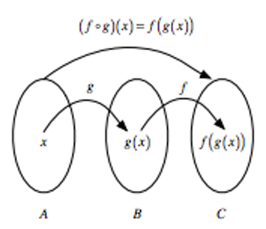

+----------------------------------------------------------------------------------------------------------------------+----------------------------------------------------------------------------------------------------------------------------------------------------------------------------------+----------------------------------------------------------------------------------------------------------------------------------------------------+-------------------------+-----+------------------------+-----+-----------------------------+----+
|                                                                                                                      |                                                                                                                                                                                  |                                                                                                                                                    |                         |     |                        |     |                             |    |
+======================================================================================================================+==================================================================================================================================================================================+====================================================================================================================================================+=========================+=====+========================+=====+=============================+====+
|                                                                                                                      |                                                                                                                                                                                  |                                                                                                                                                    |                         |     |                        |     |                             |    |
+----------------------------------------------------------------------------------------------------------------------+----------------------------------------------------------------------------------------------------------------------------------------------------------------------------------+----------------------------------------------------------------------------------------------------------------------------------------------------+-------------------------+-----+------------------------+-----+-----------------------------+----+
|                                                                                                                      |                                                                                                                                                                                  |                                                                                                                                                    | **A vector**            |     | **A\                   |     | **A\                        |    |
|                                                                                                                      |                                                                                                                                                                                  |                                                                                                                                                    |                         |     | matriz**               |     | data frame**                |    |
|                                                                                                                      |                                                                                                                                                                                  |                                                                                                                                                    | **más largo**           |     |                        |     |                             |    |
+----------------------------------------------------------------------------------------------------------------------+----------------------------------------------------------------------------------------------------------------------------------------------------------------------------------+----------------------------------------------------------------------------------------------------------------------------------------------------+-------------------------+-----+------------------------+-----+-----------------------------+----+
|                                                                                                                      |                                                                                                                                                                                  |                                                                                                                                                    |                         |     |                        |     |                             |    |
+----------------------------------------------------------------------------------------------------------------------+----------------------------------------------------------------------------------------------------------------------------------------------------------------------------------+----------------------------------------------------------------------------------------------------------------------------------------------------+-------------------------+-----+------------------------+-----+-----------------------------+----+
|                                                                                                                      | **de**                                                                                                                                                                           |                                                                                                                                                    | **c**(x,y)\             |     | **cbind**(x,y)\        |     | **data.frame**(x,y)         |    |
|                                                                                                                      |                                                                                                                                                                                  |                                                                                                                                                    |                         |     | **rbind**(x,y)         |     |                             |    |
|                                                                                                                      | **vector**                                                                                                                                                                       |                                                                                                                                                    |                         |     |                        |     |                             |    |
+----------------------------------------------------------------------------------------------------------------------+----------------------------------------------------------------------------------------------------------------------------------------------------------------------------------+----------------------------------------------------------------------------------------------------------------------------------------------------+-------------------------+-----+------------------------+-----+-----------------------------+----+
|                                                                                                                      |                                                                                                                                                                                  |                                                                                                                                                    |                         |     |                        |     |                             |    |
+----------------------------------------------------------------------------------------------------------------------+----------------------------------------------------------------------------------------------------------------------------------------------------------------------------------+----------------------------------------------------------------------------------------------------------------------------------------------------+-------------------------+-----+------------------------+-----+-----------------------------+----+
|                                                                                                                      | **de**                                                                                                                                                                           |                                                                                                                                                    | **as.vector**(mymatrix) |     |                        |     | **as.data.frame**(mymatrix) |    |
|                                                                                                                      |                                                                                                                                                                                  |                                                                                                                                                    |                         |     |                        |     |                             |    |
|                                                                                                                      | **matriz**                                                                                                                                                                       |                                                                                                                                                    |                         |     |                        |     |                             |    |
+----------------------------------------------------------------------------------------------------------------------+----------------------------------------------------------------------------------------------------------------------------------------------------------------------------------+----------------------------------------------------------------------------------------------------------------------------------------------------+-------------------------+-----+------------------------+-----+-----------------------------+----+
|                                                                                                                      |                                                                                                                                                                                  |                                                                                                                                                    |                         |     |                        |     |                             |    |
+----------------------------------------------------------------------------------------------------------------------+----------------------------------------------------------------------------------------------------------------------------------------------------------------------------------+----------------------------------------------------------------------------------------------------------------------------------------------------+-------------------------+-----+------------------------+-----+-----------------------------+----+
|                                                                                                                      | **de\                                                                                                                                                                            |                                                                                                                                                    |                         |     | **as.matrix**(myframe) |     |                             |    |
|                                                                                                                      | data frame**                                                                                                                                                                     |                                                                                                                                                    |                         |     |                        |     |                             |    |
+----------------------------------------------------------------------------------------------------------------------+----------------------------------------------------------------------------------------------------------------------------------------------------------------------------------+----------------------------------------------------------------------------------------------------------------------------------------------------+-------------------------+-----+------------------------+-----+-----------------------------+----+
|                                                                                                                      |                                                                                                                                                                                  |                                                                                                                                                    |                         |     |                        |     |                             |    |
+----------------------------------------------------------------------------------------------------------------------+----------------------------------------------------------------------------------------------------------------------------------------------------------------------------------+----------------------------------------------------------------------------------------------------------------------------------------------------+-------------------------+-----+------------------------+-----+-----------------------------+----+

# Data wrangling: filtrado y selección de variables. Diferencias Rbase, tidyverse

💡 Cuando trabajamos con datos tipo "data.frame" fila es una *observación"* y cada columna es una "*variable*. Esto parece sencillo, pero *¿realmente ocurre así?* primero asegurate de la estructura de tus datos, que la comprendes e intenta trabajar con tidy data.

 [Imagen de Allson Horst](https://allisonhorst.com/everything-else)

Siempre nos debemos asegurar que nuestros datos siguen un formato "tidy" y volveremos sobre esto más adelante, a lo largo de *TODO* el curso...

 [Imagen de Allson Horst](https://allisonhorst.com/everything-else)

📝 En esta sección vamos a comparar dos operaciones muy comunes en manipulación de datos:

- `select()` para **elegir columnas**\
- `filter()` para **elegir filas**

Primero veremos cómo se hacen en **base R** y luego con el **tidyverse**. Usaremos el dataset incorporado en R llamado `mtcars`, que contiene información de automóviles. Podéis ver más información para la exploración de esta base de datos aquí: https://cran.r-project.org/web/packages/explore/vignettes/explore-mtcars.html

Los datos fueron extraidos de 1974 Motor Trend US magazine, contienen consumo de gasolina y 19 aspectos del diseño del automovil para 32 automoviles.

```{r}
# Cargar librerías
library(tidyverse) #para dplyr y ggplot

# Vistazo rápido a los datos
head(mtcars, 5)

names(mtcars)

head(mtcars, n = 4) #rbase
mtcars |> #dplyr
  head(n = 4)
```

Nuestro objetivo: seleccionar la mejor marca (no real), que tiene un mayor número de millas por US gallon multiplicado por el número de cilindos. Para lo que: 1. Conocemos los datos 2. Seleccionamos variables de interés 3. Filtramos los coches con un numero de cilindos mayor de 4 4. Los colocamos en orden descendiente 5. Mostramos los resultados: nuestro primer gráfico

## 1. Conoce tus datos para una pregunta concreta

```{r}

#### readr (read rectangular data) ####
write.table(mtcars, "resultados\\cars.txt", sep = "\t")

cars_df <- read.table("resultados\\cars.txt", sep = "\t",
                      header = TRUE)

#check the data
str(cars_df)
glimpse(cars_df)
head(cars_df)
tail(cars_df)
summary(cars_df)
names(cars_df)
dim(cars_df)
nrow(cars_df)
ncol(cars_df)
```

#### Ejercicio 1: conoce la estructura de tus datos 🧩

Piensa y escribe en una línea qué hace cada función y discutelo con el compañero

## 2. Selección de variables de interés: Rbase vs. tidyverse

Queremos seleccionar las variables `mpg` (millas por galón) y `cyl` (número de cilindros), además de la marca.

### Con Base R

```{r}
select_mtcars_Rbase1 <- mtcars[, c("mpg", "cyl")]
select_mtcars_Rbase3 <- mtcars[, c(1, 2)]
```

### Con tidyverse (`select()`)

```{r}
select_mtcars_tidyverse <- mtcars |>
  select(mpg, cyl)
```

#### Ejercicio 2: diferencias entre Rbase y tidyverse 🧩

¿Qué es más sencillo de entender? ¿y más reproducible de las tres opciones que hemos visto?

------------------------------------------------------------------------

# 3. Filtramos los coches con un numero de cilindos mayor de 4

Queremos quedarnos solo con los coches que tienen más de **4 cilindros**.

### Con Base R

```{r}
select_mtcars_filtado <- mtcars[select_mtcars_tidyverse$cyl > 4, ]
```

### Con tidyverse (`filter()`)

```{r}
select_mtcars_tidyverse |>
  filter(cyl > 4)
```

------------------------------------------------------------------------

# 4. Lo colocamos en orden descendiente, combinando operaciones

Queremos quedarnos solo con las columnas `mpg` y `cyl`, y además filtrar los coches que tengan **4 cilindros**, y ordenarlo en orden descendiente.

Para comprender lo que hacemos tenemos que usar la pipa:


no hace más que lo siguiente, pero ayuda a mucho a comprender y sintetizar código, porque ¿en qué sentido hablamos los humanos?



### Con tidyverse (piping)

```{r}
cars_cyl <- cars_df |> 
  select(cyl, mpg) |>
  filter(cyl > 4) |> 
  mutate(mpg_cyl = mpg * cyl)|> 
  arrange(mpg_cyl) 
```

👉 Ventajas: más intuitivo, cada paso es claro y en “lenguaje natural”. 👉 Inconvenientes: requiere instalar/cargar dplyr.

### Con Rbase (piping)

```{r}
#sin pipa
mtcars_Rbase1 <- mtcars[select_mtcars_tidyverse$cyl > 4, c("mpg", "cyl")] 
mtcars_Rbase1$mpg_cyl <- mtcars_Rbase1$cyl * mtcars_Rbase1$mpg
mtcars_sorted <- mtcars_Rbase1[order(mtcars_Rbase1$mpg_cyl), ]

#con pipa:
mtcars_sorted <- mtcars |>
  (\(x) x[x$cyl > 4, c("mpg", "cyl")])() |>          # filtrar y seleccionar
  (\(x) transform(x, mpg_cyl = cyl * mpg))() |>      # crear nueva columna
  (\(x) x[order(x$mpg_cyl), ])()                     # ordenar

```

👉 Ventajas: usa solo R base, no necesita librerías adicionales. 👉 Inconvenientes: la sintaxis es más dificil para alumnos principiantes, menos legible.

##5. Mostramos los resultados: nuestro primer gráfico

Gráfico base R

```{r}
plot(mtcars_sorted$cyl, mtcars_sorted$mpg_cyl,
     main = "",
     xlab = "Número de cilindros", 
     ylab = "mpg * cyl",
     pch = 19, col = "blue")
```

Gráfico con ggplot2, paquete de gráficos de tidyverse

```{r}
ggplot(mtcars_sorted, aes(x = cyl, y = mpg_cyl)) +
  geom_point(color = "darkred", size = 3) +
  labs(title = "Relación mpg_cyl ~ cyl (tidyverse)",
       x = "Número de cilindros",
       y = "mpg * cyl") +
  theme_minimal()
```

------------------------------------------------------------------------

#### Ejercicio 3: practica la selección y filtrado con la pipa 🧩

Ahora es vuestro turno 💡:

1.  **Ejercicio 1:** Selecciona solo las columnas `mpg` y `hp` de `mtcars` usando tanto base R como tidyverse.\
2.  **Ejercicio 2:** Filtra los coches que tengan más de 100 caballos de potencia (`hp > 100`). Calcula la media de las cilindradas\
3.  **Ejercicio 3 (reto):** Usando tidyverse, selecciona las columnas `mpg`, `cyl` y `hp`, y quédate solo con los coches que tengan más de 20 mpg **y** 4 cilindros. Calcula la media, y rangos (mínimo, máximo) de mpg.

Envia las contestaciones de los ejercicios (2) y (3) por el aula virtual.

------------------------------------------------------------------------

# Conclusión

- `select()` = elegir columnas (variables).\
- `filter()` = elegir filas (observaciones).\
- La forma tidyverse es más legible cuando se encadenan varias operaciones, especialmente cuando se tuliza con la pipa.


