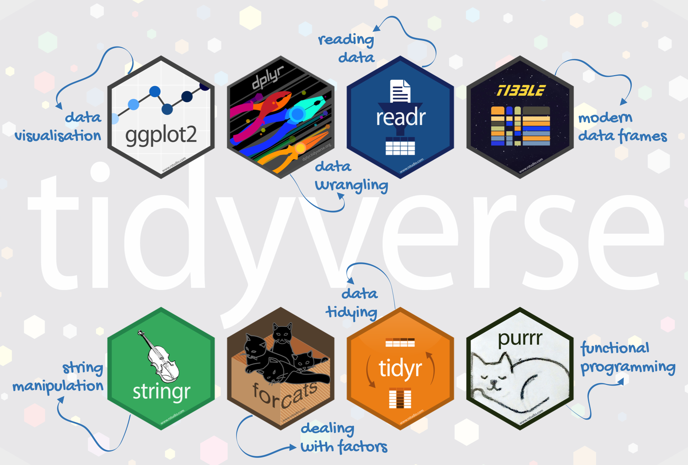
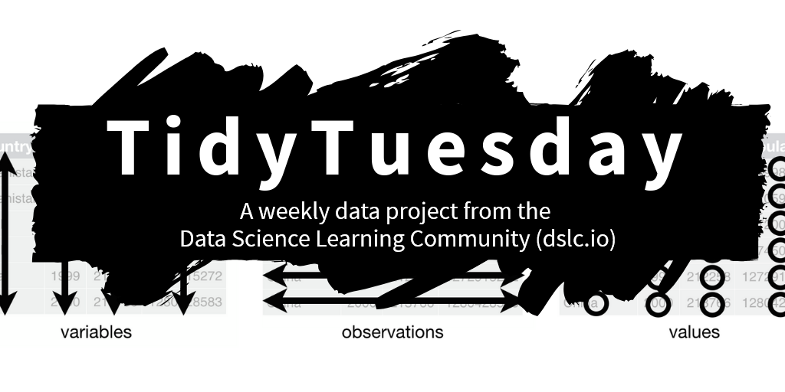
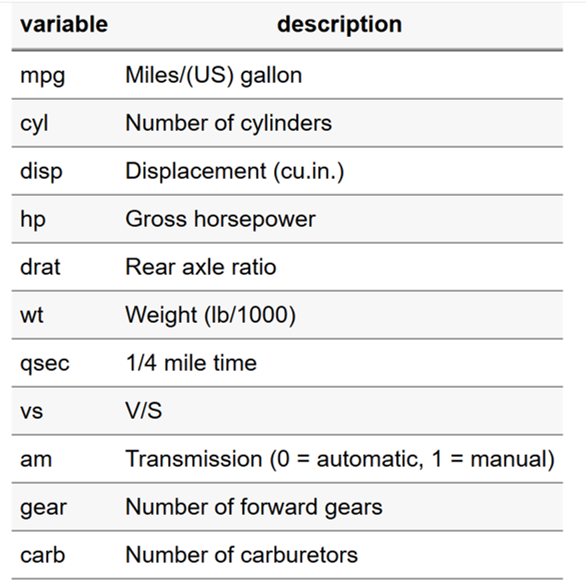
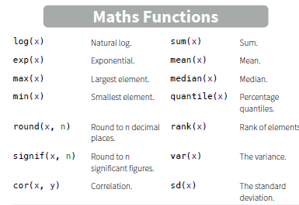

# Diferencias Rbase, tidyverse

En R existen distintas formas de realizar una misma tarea. Debéis conocer las principales diferencias entre **R base** y **`tidyverse`**.

## Rbase

**R base** (*base R*) es el conjunto de funciones y herramientas que están disponibles al instalar R, sin necesidad de instalar paquetes adicionales. Permite crear y manipular objetos, realizar cálculos, seleccionar datos, aplicar funciones, hacer gráficos, etc.

## Tidyverse

A lo largo del curso trabajaremos principalmente con **`tidyverse`**, una colección de paquetes de R diseñada para facilitar la manipulación, análisis y visualización de datos. Aunque veremos algunos conceptos y funciones de R base, la mayor parte de los ejemplos y ejercicios se realizarán utilizando `tidyverse`.

{width="310"}

[Imagen de Allson Horst](https://allisonhorst.com/everything-else)

`tidyverse` es una colección de paquetes de R diseñada para la ciencia de datos y basada en una forma concreta y coherente de trabajar.

Todos sus paquetes comparten una misma filosofía de diseño, gramática y estructuras de datos. — tidyverse

💡 **tidyverse** está fundamentalmente **centrado en las personas** (human-centred): está diseñado para facilitar que las personas puedan leer, escribir y comprender el código (Wickham et al., 2019).

{width="414"}

## `tidyr`: datos ordenados (*tidy data*)

El paquete **`tidyr`** nos ayuda a organizar los datos siguiendo los principios de *tidy data*. Un conjunto de datos está en formato **tidy** cuando cumple tres características:

1.  📝 **Cada columna representa una variable.**

2.  📝 **Cada fila representa una observación.**

3.  📝 **Cada celda contiene un único valor.**

Esta estructura facilita la manipulación, visualización y análisis posterior de los datos con las herramientas de `tidyverse`.

🔎 [Consulta este post de Julie Lowndes y Allison Horst](https://www.openscapes.org/blog/2020/10/12/tidy-data/) para ver ejemplos visuales de *tidy data*.

💡 Cuando trabajamos con datos tipo "data.frame" fila es una *observación* y cada columna es una *variable*. Esto parece sencillo, pero *¿realmente ocurre así?* primero asegurate de que conoces la **estructura de tus datos**, que la comprendes e intenta trabajar con **tidy data**.

{width="349"} [Imagen de Allson Horst](https://allisonhorst.com/everything-else)

Siempre nos debemos asegurar que nuestros datos siguen un formato "tidy" y volveremos sobre esto más adelante, a lo largo de *TODO* el curso...

{width="382"} [Imagen de Allson Horst](https://allisonhorst.com/everything-else)

———————————————————————————————————

#### 📝 Ejercicio: analiza si son datos tidy

En en aula virtual te hemos dejado un archivo de dato "co_data.csv": leelo usando la función `read_csv()` o `read.csv()`. Analiza si son datos "tidyr", tipos de datos, nº de columnas, nº de filas; así como estadísticas básicas de media, rango, etc.

———————————————————————————————————

# Importar y renombrar datos

Vamos a trabajar con datos de Tidytuesday y de las librerias de tidyverse principalmente. En todos los casos son datos reales.

Tidytuesday es un proyecto comunitario de ciencia de datos impulsado por la comunidad de R, especialmente por usuarios de tidyverse. Cada martes se publica un dataset limpio y listo para analizar, junto con una breve descripción y enlaces a la fuente original.



Para aprender a leer y limpiar datos (que es el objetivo de tidyTuesday), vamos a trabajar con un set de datos de esta planaforma; en este caso datos cuisine:

+----------------------------------+-------------------------------------------------------------------------------------------------------------------------------------------------------+
|  | **CUISINE**                                                                                                                                           |
|                                  |                                                                                                                                                       |
|                                  | El dataset de **Cuisine** de TidyTuesday recopila información sobre recetas y tipos de cocina (origen, valor nutricional, tiempo de preparación etc.) |
+----------------------------------+-------------------------------------------------------------------------------------------------------------------------------------------------------+

### [Read_delim](https://readr.tidyverse.org/reference/read_delim.html): leer datos desde fuera de R

Leer datos que tenemos almacenados, como por ejemplo, una tabla en formato csv.

```{r read}

library(tidyverse)  
recetas <- read_delim(file = "data/cuisines.csv", 
                      delim = ",")  # con el argumento col_type puedo especificar el tipo de dato (en este caso country como factor) 
recetas <- read_delim(
  file = "data/cuisines.csv",
  delim = ",",
  col_type = list(country = "f", servings = "f")
)  

recetas   
View(recetas) 
summary(recetas) 
glimpse(recetas)
```

### [Rename](https://dplyr.tidyverse.org/reference/rename.html): cambiar nombres de variables (columnas)

```{r rename}
# Consulto el nombre de las columnas 
names(recetas)  
# Cambio el nombre y añado la unidad de medida (gramos)

recetas_g <- recetas |>
  rename(
    fat_g = fat,
    carbs_g = carbs,
    # nombre nuevo = nombre viejo
    protein_g = protein
  ) 
```

📝 Ajustar sangría de código: Ctrl + i; Reformatear código: Ctrl + Shift + a

### [Slice](https://dplyr.tidyverse.org/reference/slice.html): filtrar filas según el índice numérico

Seleccionar filas concretas del set de datos

```{r slice} # warning: false}
recetas |> 
  # shortcut para el pipe: CTRL + SHIFT + M   
  slice(1) # la primera fila  

recetas |>   
  slice(1, 5) # la fila 1 y la 5  

recetas |>    
  slice(1:5) # de la fila 1 a la 5  

recetas |>   
  slice(-c(1:5)) # todas las filas excepto de la 1 a la 5 
```

### [Filter](https://dplyr.tidyverse.org/reference/filter.html): filtrar filas utilizando condiciones

Se necesita un vector de filtrado que contenga valores lógicos (TRUE/FALSE).

```{r filter}
recetas |>   
  filter(country == "Chilean") # filtrar por filas que cumplen un patrón  

#En este caso, todass las recetas chilenas  
recetas |>   
  filter(country == "Chilean" & total_time  < 60) # combinar criterios: AND 

#En este caso, todas las recetas chilenas que se preparan en menos de 60 minutos  
recetas |>   
  filter(country == "Chilean" | total_time  < 60) 
# combinar criterios: OR 


#En este caso, todas las recetas chilenas (independientemente del tiempo de preparación) o bien aquellas recetas que se preparen en menos de 60mins (independientemente del país)  
recetas |>   
  filter(country %in% c("Chilean", "Brazilian", "Peruvian")) # combinar criterios: %in%   

#En este caso, todas las recetas de países del cono sur. Es equivalente a:  
recetas |>   
  filter(country == "Chilean" | country == "Brazilian"| country == "Peruvian")  
```

—————————————————————————————————

#### 📝 Ejercicio: slice(), filter(), arrange()

+---------------------------------------------------+-----------------------------------------------------------------------------------------------------------------------------------------------------------------------------------------------------+
|  | -   Lee el data.frame “msleep.csv”. Pista: el delimitador entre datos es la coma (“,”).                                                                                                             |
|                                                   |                                                                                                                                                                                                     |
|                                                   | -   Crea un subset que NO contenga los animales domésticos (campo conservation). ¿Cuantas son?                                                                                                      |
|                                                   |                                                                                                                                                                                                     |
|                                                   | -   Crea un subset de datos que contenga las filas de la 1 a la 5 y de la 18 a la 20, sobre esos datos obten los animales carnívoros. Ordena según las horas de sueño ¿Qué animal duerme más horas? |
+---------------------------------------------------+-----------------------------------------------------------------------------------------------------------------------------------------------------------------------------------------------------+

: —————————————————————————————————

### [Select](https://dplyr.tidyverse.org/reference/select.html): sirve para seleccionar columnas utilizando condiciones

Permite seleccionar columnas. Las podemos seleccionar por nombre, posición o usando alguna de las condiciones que puedes ver si consultas la ayuda de la función (`?select`).

```{r select}
names(recetas)  # ?select 

recetas |>   
  select(name, calories, fat, carbs, protein) #solo nos interesan las columnas con informacion nutricional de cada receta  

recetas |>   
  select(name, calories, fat, carbs, protein)  # Se puede usar un patron de texto pra seleccionar colmunas 

recetas |>   
  select(ends_with("time")) # solo nos interesan las columnas relacionadas con el tiempo  

# se pueden utilizar todo tipo de patrones de texto: https://rstudio.github.io/cheatsheets/strings.pdf  

recetas |>   
  select(name,author, everything()) # se puede usar para reordenar variables  

recetas |>   
  select(recipes_name=name, country, author, reviews) # y para renombrarlas a la vez que hacemos la seleccion 
```

—————————————————————————————————

#### 📝 Ejercicio: select()

+---------------------------------------------------+--------------------------------------------------------------------------------------------------------------------------------------------------------------+
|  | -   Con el data set de msleep, crea un nuevo data.frame que contenga las variables relacionadas con el sueño.                                                |
|                                                   |                                                                                                                                                              |
|                                                   | -   Con el data set de msleep, crea un nuevo data.frame que contenga todas las variables excepto el estado de conservacion.                                  |
|                                                   |                                                                                                                                                              |
|                                                   | -   (extra) Crea un nuevo objeto (data frame) con el orden, género y nombre al principio y que incluya todas las demás columnas excepto el tiempo despierto. |
+---------------------------------------------------+--------------------------------------------------------------------------------------------------------------------------------------------------------------+

: —————————————————————————————————

# Ejercicio completo con mtcars

En esta sección vamos a comparar dos operaciones muy comunes en manipulación de datos:

-   `select()` para **elegir columnas (variables)**
-   `slice()` para **seleccionar filas según su posición (observaciones)**
-   `filter()` para **seleccionar filas según valores (observaciones)**

Primero veremos cómo se hacen en **base R** y luego con el **tidyverse**. Usaremos el dataset incorporado en R llamado `mtcars`, que contiene información de automóviles.

Podéis ver más información para la exploración de esta base de datos aquí:

<https://cran.r-project.org/web/packages/explore/vignettes/explore-mtcars.html>

{width="261"}

Los datos fueron extraidos de 1974 Motor Trend US magazine, contienen consumo de gasolina y **19 aspectos del diseño del automovil** para **32 automoviles**, ¿cuántas filas y columnas podemos esperar? ¿por qué?

```{r}
# Cargar librerías
library(tidyverse) #para dplyr y ggplot

# Vistazo rápido a los datos
head(mtcars, 5)

names(mtcars)

head(mtcars, n = 4) #rbase
mtcars |> #dplyr #pipa
  head(n = 4)
```

Para comprender lo que hacemos tenemos que usar la pipa:

{width="173"}

no hace más que lo siguiente, pero ayuda a mucho a comprender y sintetizar código, porque ¿en qué sentido hablamos los humanos?

{width="185"}

**Nuestro objetivo:** seleccionar la mejor marca (no real), que tiene un mayor número de millas por US gallon multiplicado por el número de cilindos. Para lo que:

1.  Conocemos los datos

2.  Seleccionamos variables de interés

3.  Filtramos los coches con un numero de cilindos mayor de 4

4.  Los colocamos en orden descendiente

5.  Mostramos los resultados: nuestro primer gráfico

## Conoce tus datos para una pregunta concreta

```{r}

#### readr (read rectangular data) ####
write.table(mtcars, "resultados\\cars.txt", sep = "\t")

cars_df <- read.table("resultados\\cars.txt", sep = "\t",
                      header = TRUE)

#check the data
str(cars_df)
glimpse(cars_df)
head(cars_df)
tail(cars_df)
summary(cars_df)
names(cars_df)
dim(cars_df)
nrow(cars_df)
ncol(cars_df)
```

———————————————————————————————————

#### 📝 Ejercicio: conoce la estructura de tus datos

Piensa y escribe en una línea qué hace cada función y discutelo con el compañero

———————————————————————————————————

Recuerda, SIEMPRE debes conocer tus datos y dar esa información ANTES de empezar un análisis:

-   ¿Qué tipo de datos tienes?

-   ¿Cuántas observaciones? ¿Qué es tu unidad de observación?

-   ¿Cuantas columnas? ¿Qué unidades y qué rangos tienen?

## Selección de variables de interés: Rbase vs. tidyverse

Queremos seleccionar las variables `mpg` (millas por galón) y `cyl` (número de cilindros), además de la marca.

### Con Base R

```{r}
select_mtcars_Rbase1 <- mtcars[, c("mpg", "cyl")]
select_mtcars_Rbase3 <- mtcars[, c(1, 2)]
```

### Con tidyverse (`select()`)

```{r}
select_mtcars_tidyverse <- mtcars |>
  select(mpg, cyl)
```

#### 📝 Ejercicio: diferencias entre Rbase y tidyverse

¿Qué es más sencillo de entender? ¿y más reproducible de las tres opciones que hemos visto?

------------------------------------------------------------------------

# Filtramos los coches con un numero de cilindos mayor de 4

Queremos quedarnos solo con los coches que tienen más de **4 cilindros**.

### Con Base R

```{r}
select_mtcars_filtado <- mtcars[select_mtcars_tidyverse$cyl > 4, ]
```

### Con tidyverse (`filter()`)

```{r}
select_mtcars_tidyverse |>
  filter(cyl > 4)
```

------------------------------------------------------------------------

# Lo colocamos en orden descendiente, combinando operaciones

Queremos quedarnos solo con las columnas `mpg` y `cyl`, y además filtrar los coches que tengan **4 cilindros**, y ordenarlo en orden descendiente.

### Con tidyverse (piping)

```{r}
cars_cyl <- cars_df |> 
  select(cyl, mpg) |>
  filter(cyl > 4) |> 
  mutate(mpg_cyl = mpg * cyl)|> 
  arrange(mpg_cyl) 
```

👉 Ventajas: más intuitivo, cada paso es claro y en “lenguaje natural”. 👉 Inconvenientes: requiere instalar/cargar dplyr.

### Con Rbase (piping)

```{r}
#sin pipa
mtcars_Rbase1 <- mtcars[select_mtcars_tidyverse$cyl > 4, c("mpg", "cyl")] 
mtcars_Rbase1$mpg_cyl <- mtcars_Rbase1$cyl * mtcars_Rbase1$mpg
mtcars_sorted <- mtcars_Rbase1[order(mtcars_Rbase1$mpg_cyl), ]

#con pipa:
mtcars_sorted <- mtcars |>
  (\(x) x[x$cyl > 4, c("mpg", "cyl")])() |>          # filtrar y seleccionar
  (\(x) transform(x, mpg_cyl = cyl * mpg))() |>      # crear nueva columna
  (\(x) x[order(x$mpg_cyl), ])()                     # ordenar

```

👉 Ventajas: usa solo R base, no necesita librerías adicionales. 👉 Inconvenientes: la sintaxis es más dificil para alumnos principiantes, menos legible.

# Mostramos los resultados: nuestro primer gráfico

Gráfico base R

```{r}
plot(mtcars_sorted$cyl, mtcars_sorted$mpg_cyl,
     main = "",
     xlab = "Número de cilindros", 
     ylab = "mpg * cyl",
     pch = 19, col = "blue")
```

Gráfico con ggplot2, paquete de gráficos de tidyverse

```{r}
ggplot(mtcars_sorted, aes(x = cyl, y = mpg_cyl)) +
  geom_point(color = "darkred", size = 3) +
  labs(title = "Relación mpg_cyl ~ cyl (tidyverse)",
       x = "Número de cilindros",
       y = "mpg * cyl") +
  theme_minimal()
```

------------------------------------------------------------------------

#### 📝 Ejercicio: practica la selección y filtrado con la pipa

Ahora es vuestro turno 💡:

1.  **Ejercicio 1:** Selecciona solo las columnas `mpg` y `hp` de `mtcars` usando tanto base R como tidyverse.\
2.  **Ejercicio 2:** Filtra los coches que tengan más de 100 caballos de potencia (`hp > 100`). Calcula la media de las cilindradas\
3.  **Ejercicio 3 (reto):** Usando tidyverse, selecciona las columnas `mpg`, `cyl` y `hp`, y quédate solo con los coches que tengan más de 20 mpg **y** 4 cilindros. Calcula la media, y rangos (mínimo, máximo) de mpg.

Envia las contestaciones de los ejercicios (2) y (3) por el aula virtual.

------------------------------------------------------------------------

# Manipulación de datos: calculo de estadísticas

Podemos calcular estadísticas básicas sobre mtcars, tal y como ya hicimos en la sección anterior lo más fácil sería con `summary()`. Sin embargo, existen múltiples funciones que nos permiten usar y calcular estarísticas básicas de las distintas variables, como la media, la mínima, máxima, desviación estándar, o percentiles.

{width="191"}

[Rbase cheatsheet](https://rstudio.github.io/cheatsheets/base-r.pdf)

Por favor, cuando calcules estatadísticas básicas sigue el protocolo para la exploración de datos que te facilito en al aula virtual, siguiendo [Zuur et al. (2009)](https://besjournals.onlinelibrary.wiley.com/doi/epdf/10.1111/j.2041-210X.2009.00001.x) y los siguientes principios:

](images/protocol_data_exploration.png){width="360"}

Repasa cada uno de los puntos sugeridos para una buena exploración de datos, y considera ¿tengo claro todos los puntos? Yo suelo usar cinco bloques en el análisis exploratior

-   **(0)** **Estructura de datos**: ¿qué unidad muestral tengo? ¿cuantas filas?; ¿Qué variables tengo?¿cuántas columnas y con qué unidades?; ¿Qué tipo de datos son cada columna?

-   **(1) Datos ánomalos, ceros y celdas vacias**: ¿son reales? ¿Qué significado tienen en mis datos? ¿cómo debo tratarlos?

-   **(2) Distribución de las variables**: ¿Proporciono medidas de centralidad y desviación de mis variables? ¿Son los datos normales? ¿Son homogéneos? ¿Debo eliminar, transformar o ignorar la distribución de las variables? ¿qué consecuencias tiene los cambios realizados?

-   **(3) Relaciones e interacciones**: ¿Son importantes las relaciones entre variables para el análisis que quiero hacer?

-   **(4) Colinealidad o correlaciones**: ¿Tengo colinealidad en mis datos?

-   **(5) Independencia**: ¿son mis datos independientes entre si?

#### 📝 Ejercicio: calcular estadisticas básicas. Repasa cada uno de los puntos propuestos en Zuur et al. (2009) o los cinco puntos propuestos más arriba.

# 🚀 Selecciona ejemplos de TidyTuesday y explica los pasos que generalmente se realizan en la limpieza de datos.

<https://rfordatascience.github.io/tidytuesday/about.html>

# Conclusión

-   `select()` = elegir columnas (variables).\
-   `filter()` = elegir filas (observaciones).\
-   La forma tidyverse es más legible cuando se encadenan varias operaciones, especialmente cuando se tuliza con la pipa.

{width="213"}
