# Introducción

**La reproducibilidad y la trazabilidad** de los análisis están ganando cada vez más importancia en diversos campos de estudio a medida que el volumen de datos aumenta y los análisis se hacen más complejos. En la sesión de hoy aprenderemos cómo **Quarto** puede utilizarse para generar documentos reproducibles, **Git** puede usarse para controlar los cambios realizados en proyectos o archivos y veremos cómo este control de versiones y su trazabilidad es especialmente útil en proyectos colaborativos mediante el uso de un servidor de alojamiento en línea como **GitHub**.

Estas herramientas nos pueden ayudar a solucionar algunos **problemas comunes** derivados de la creación de diferentes versiones y la falta de reproducibilidad que pueden ser un poco molestos:

\- Sobreescritura de un archivo

\- Versiones finales infinitas


\- Trabajo por error en una versión que no era la final

\- Creación de copias "en conflicto" cuando dos personas trabajan a la vez

\- Ediciones sin control de cambios

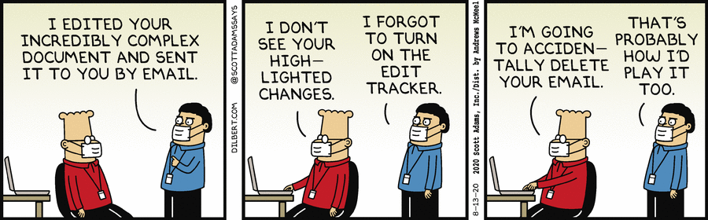{alt="Ediciones sin control de cambios" fig-align="center" width="70%"}

En [*The Turing Way*](https://book.the-turing-way.org/) definen la **investigación reproducible** como aquel trabajo que puede recrearse de forma independiente a partir de los mismos datos y el mismo código que utilizó el equipo original. Lo reproducible es distinto de lo replicable, robusto y generalizable, tal y como se describe en la figura siguiente.

{fig-align="mid" width="50%"}

Dentro del **modelo de ciencia de datos**, en la sesión de hoy nos centraremos en la parte de comunicar resultados a través de documentos dinámicos. Además, aprenderemos como controlar y trazar todo este modelo de análisis.

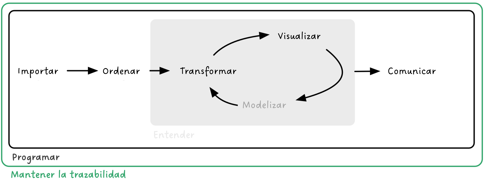{#fig-datascience}

Los **objetivos concretos** son:

-   Comprender la importancia de los flujos de análisis reproducibles.

-   Aprender las bases de la programación literaria en R.

-   Aprender los fundamentos básicos de Quarto.

-   Generar documentos reproducibles en R.

-   Comprender la funcionalidad y potencialidad de Git y GitHub en investigación.

-   Comprender el flujo de trabajo entre Git, GitHub y RStudio.

-   Aprender las bases de trabajo colaborativo con Git y GitHub.

#### 📝 *Ejercicio*

Iniciate en el mundo de la ciencia colaborativa y reproducible descargandote los apuntes del curso de esta organización de GitHub: [DatSciR](https://github.com/DatSciR?view_as=public)

# Introducción a Quarto y R Markdown

**R Markdown** (<https://rmarkdown.rstudio.com/>) empezó en 2012 con el objetivo de facilitar la reproducibilidad en R. Ha sido desarrollado principalmente por [Yihui Xie](https://yihui.org/). R Markdown es un formato de archivo para crear documentos dinámicos con R que se apoya en [**`knitr`**](https://yihui.org/knitr/) (paquete para generación de informes dinámicos en Markdown) y [**Pandoc**](https://pandoc.org/) (conversor de documentos) para crear documentos estáticos (p. ej. PDF).

R Markdown utiliza **programación literaria**, un paradigma de programación creado por Donald E. Knuth que consiste en escribir un texto narrativo (p. ej. inglés, castellano) con fragmentos de código e instrucciones. R Markdown está escrito en **Markdown** (un lenguaje de marcado ligero que permite escribir texto con formato usando símbolos simples) y contiene partes de **código de R** (o algún otro lenguaje de programación) integrado.

R Markdown nace en el ecosistema R pero en 2022 se lanza **Quarto** (<https://quarto.org/>) que es una **evolución y generalización de R Markdown**. Quarto se ha generado para la colaboración de más de una comunidad (es decir, no solo usuarios de R o Python), tiene sintaxis compartida entre diferentes editores de código y lenguajes y viene preinstalado con las últimas versiones de RStudio. Es decir, no se tienen que instalar diferentes paquetes para crear diferentes formatos de salida.

**Quarto** es un sistema de publicación científica y técnica de código abierto construido sobre Pandoc. Convierte los formatos de texto plano o los formatos mixtos (p. ej. **`.qmd`**, `.Rmd`, `.md`, `.ipynb`) en informes estáticos PDF, word, HTML, etc. Puede entrelazar texto narrativo y código para producir resultados con un formato elegante en forma de documentos, páginas web, entradas de blog, libros, etc. Para ello, Quarto utiliza un ***engine*** como `knitr` o `jupyter` para ejecutar el código y generar una salida temporal `.md`. El archivo `.md` se procesa mediante Pandoc y los **filtros Lua** de Quarto que modifican la estructura del documento antes del resultado final (p. ej. para modificar las referencias cruzadas). **Lua** es el lenguaje de extensión de Pandoc (<https://quarto.org/docs/extensions/lua.html>). Además, para definir el **estilo visual** Quarto utiliza Bootstrap y CSS (*Cascading Style Sheets*) para obtener un HTML o LaTeX para un PDF.


Sea cual sea el sistema, Quarto y R Markdown aumentan de la eficiencia de trabajo (a medio-largo plazo), permiten centrarse en el texto sin perder tiempo en el diseño y permiten la producción de documentos de alta calidad.

# Fundamentos básicos de Quarto

Para crear un archivo Quarto: *File -\> New File -\> Quarto document*. Debemos cambiar el modelo mental: ahora tendremos un documento fuente de texto plano y a partir de dicho documento generamos un documento renderizado. Estos archivos tienen tres componentes principales: (i) metadatos, (ii) texto, (iii) código.

-   **Metadatos:** se delimita entre `` `---` `` al principio del archivo Quarto. Utiliza la **sintaxis de [YAML](https://en.wikipedia.org/wiki/YAML)** (*Yet Another Markup Language*). Se utiliza para evitar teclear manualmente todas las opciones que pueden afectar al código (opciones de ejecución), al contenido y al proceso de creación de un archivo estático.

::: callout-important
El YAML consiste en pares de `campo: valor`. Los dos puntos y el espacio son esenciales. ¡Y la sangría es muuuuy importante!
:::

En el YAML se es especifica el [formado de salida](https://quarto.org/docs/output-formats/all-formats.html). Puedes encontrar todas las opciones de ejecución y creación del archivo estático en la [guía de referencia de Quarto](https://quarto.org/docs/reference/).

-   **Texto:** sintaxis Markdown. Markdown es un lenguaje de marcado ligero que permite escribir texto con formato usando símbolos simples. Está diseñado para ser fácil de escribir y, aún más importante, fácil de leer.

::: callout-note
💡Con el editor visual de RStudio puedes ver en tiempo real cómo es la conversión a word, HTML, etc. del texto Markdown.
:::

-   **Código** (dos tipos):

    -   ***Code chunk*** **(bloque):** se escribe ```` ```{lenguaje nombre_chunck} codigo aqui``` ````; entre corchetes se indica el lenguaje. Se puede escribir manualmente, utilizar el atajo `Ctrl + Alt + I` (Mac OS: `Cmd + Option + I`), utilizar el comando `Insert -> Executable Cell` en la barra de herramientas del editor.

    -   ***Inline code*** **(en línea):** se escribe `r "código aquí"`.

::: callout-note
💡Cada opción de ejecución del chunk (<https://quarto.org/docs/computations/execution-options.html>) se especifica en una línea al principio del chunk con el *(hash pipe)* `#|`. Estas opciones presentan tabulación enriquecida, es decir, inicias una palabra y tabulas para completar o `Ctrl + espacio` para ver todas las opciones disponibles.

```{r tabulacion}
#| eval: false   

2 * 2
```
:::

Los bloques de código son compatibles con **muchos lenguajes de programación**:

```{r reticulate}
#| echo: FALSE  
#| eval: TRUE  
#| warning: FALSE    

library(knitr)   
names(knitr::knit_engines$get())   
library(reticulate) # for python
```

```{python example_python}
x = "R mola!"   
print(x.split(" "))
```

```{r example}
#| warning: FALSE     

library(ggplot2)  
names(cars)   
ggplot(cars, aes(speed, dist)) +      
  geom_point() +      
  geom_smooth()
```

## Notación Markdown

Para buscar ayuda sobre como escribir el texto plano: *Help -\> Markdown Quick Reference*.

Formato: **negrita**, *cursiva*, subíndice~1~, superíndice^2^, `código`, notas al pie[^1]

[^1]: hello world

Títulos: \# primer nivel; \## segundo nivel...

Listas y sublistas: \*, -, +

Citas:

> "La democracia es el sistema que garantiza que no seamos gobernados mejor de lo que nos merecemos."
>
> --- Ignatius Farray

Fórmulas:

$f(os) = {esta \choose gustando} esto^{?} (1-p)^{n-k}$

Comentarios:

<!--# esto es un comentario (atajo: Ctrl + Shift + C; OS X Cmd + Shift + C)-->

Tablas:

| Col1 | Col2 | Col3 |
|------|------|------|
|      |      |      |
|      |      |      |
|      |      |      |

: Esto es el pie de tabla {#tbl-trescol}

Figuras:

{#fig-rmarkdown width="30%"}

Videos:

<iframe width="560" height="315" src="https://www.youtube.com/embed/s3JldKoA0zw">

</iframe>

Links: [nombre del link](link)

Links a elementos del documento: @fig-rmarkdown; @tbl-trescol; `@eq-...`; `@sec-...`

Referencias: [@blischak2016]

::: callout-important
Para utilizar la notación MarkDown de una forma más amable RStudio incorpora en la barra de edición del modo *Visual* las opciones más comunes: 
:::

### 📝*Ejercicio*

Genera un documento Quarto que esté compuesto por al menos metadatos, código y texto. También puedes añadir otros elementos, como tablas.

## Renderización

Existen tres formas para **producir un archivo estático** (renderizar). Todas llaman a `quarto render` en un trabajo de fondo. Esto evita que el renderizado abarrote la consola de R y así es fácil de detener.

1.  Dentro de RStudio puedes usar el botón de *Render* (atajo: `Ctrl + Shift + K`; Mac OS `Cmd + Shift + K`),
2.  En el terminal mediante quarto render: 🤓

::: callout-note
¿Qué es el terminal? El *shell* (o terminal) es un programa en tu ordenador cuyo trabajo es ejecutar otros programas (ver <https://happygitwithr.com/shell.html#shell>). RStudio incorpora una terminal que se puede utilizar para interactuar con Quarto y con Git
:::

`quarto render archivo.qmd` (por defecto a HTML)

`quarto render archivo.qmd --to pdf`

`quarto render archivo.qmd --to docx`

`quarto --help`

::: callout-note
Sobre la importancia del YAML: las especificaciones del YAML se puede incluir también en el terminal, pero si las hemos incluido en el YAML no tendremos que escribirlas cada vez.

`quarto render archivo.qmd --to html`

`quarto render archivo.qmd --to html -M code-fold:true`
:::

3.  En la consola de R mediante el paquete `quarto`

`library(quarto)`

`quarto_render("archivo.qmd")`

`quarto_render("archivo.qmd", output_format = "pdf")`

#### 📝 *Ejercicio*

Renderiza el documento Quarto creado en el ejercicio anterior en un PDF y después en un word.

## ¿Qué hago si he estado utilizando R Markdown?

Aunque Quarto presenta mejores características y tendrá más mejoras en el futuro, R Markdown todavía se mantiene y quizás lo habéis estado utilizando.

¡No pasa nada! No tienes que convertir la sintaxis de todos tus documentos antiguos. Quarto es compatible con versiones anteriores de R Markdown. La mayoría de los `.Rmd` o `.ipynb` existentes se pueden convertir `as-is` a través de Quarto. Para hacerlo a través de la línea de comandos de la terminal se escribe:

`quarto render archivo.Rmd --to html`

Además existen distintas opciones para convertir archivos `.Rmd` a `.qmd`:

1.  Cambiar `.Rmd` a `.qmd` (esto siempre usará Quarto para la renderización)

2.  Cambiar la salida YAML: `html_document` a `format: html`

3.  `knitr::convert_chunk_header("archivo.Rmd", "archivo.qmd")`

# Generando el documento final

### Formato

Títulos coloreados en azul, el texto no está con un espaciado doble, no hay números de línea y... ¡manuscrito rechazado porque el formato no es adecuado! ¡PERO NO VAMOS A EDITAR NADA EN WORD! Podemos asegurarnos de que el `.docx` creado tenga siempre el formato deseado utilizando una plantilla `.docx`. Para utilizarla, la plantilla debe colocarse en la misma carpeta que el archivo `.qmd` y debemos hacer un pequeño ajuste en el YAML.

1.  Primero generamos la plantilla en el terminal:

    `quarto pandoc -o reference_custom.docx --print-default-data-file reference.docx`

2.  Modificamos la plantilla generada como la queramos utilizando los estilos de Word.💡Fíjate en [este link](https://quarto.org/docs/output-formats/ms-word-templates.html) para saber como modificar una plantilla de Word.

3.  Especificamos en el YAML que queremos usar esa plantilla.

```{r plantilla}
#| eval: false  
# format:     
#   docx:       
#     reference-doc: reference_custom.docx
```

### 🚀 Referencias

Para introducir citas y referencias en nuestro texto en Quarto utilizaremos el sistema **BibTeX** y así evitaremos tener que hacerlo manualmente. Con BibTex, en lugar de escribir la cita se escribe una "clave" única (clave de citación: `@cita`) cada vez que se cita una referencia. El sistema genera un archivo .bib que guarda las referencias en un formato estructurado.

::: callout.note
Recomendamos utilizar [**Zotero**](https://www.zotero.org/) como gestor bibliográfico porque está incluido en RStudio, lo que facilita la inclusión de citas y referencias, pero se puede utilizar cualquier otro gestor.
:::

Para añadir las referencias en algún lugar concreto del archivo se escribe:

```{r refs}
#| eval: false  
# ::: {#refs}  
#    
#:::
```

BibTex permite cambiar los **estilos de las referencias** sin tener que reformatear nada manualmente (por ejemplo, si hay que enviar un manuscrito a una revista diferente para su publicación). Para aplicar un formato específico a las referencias, en [*Zotero Style Repository*](https://www.zotero.org/styles) puedes descargar el archivo de estilo correspondiente (.cls) y especificarlo en los metadatos (ver ejemplo en el archivo .qmd de los apuntes de esta sesión).

#### 📝 *Ejercicio*

Genera una plantilla de formato y modifica los colores, tamaño de los títulos, etc. Después, añade la plantilla al YAML y renderiza de nuevo el documento de word.

# Proyectos Quarto

Cuando los proyectos son más grandes que un simple análisis (por ejemplo, un artículo con análisis adicionales presentados en material suplementario), resulta útil dividir la presentación del proyecto en varios documentos Quarto.

Los **proyectos Quarto** son **colecciones de documentos** Quarto que pueden renderizarse conjuntamente o por separado. Se definen mediante un **archivo `quarto.yml`** en el directorio raíz del proyecto. Este archivo contiene metadatos y opciones de configuración del proyecto, como el título, el autor, los formatos de salida y otros aspectos. Todos los archivos del proyecto contienen la misma configuración YAML.

Además, los proyectos pueden tener “tipos” especiales que introducen comportamientos adicionales (por ejemplo, sitios web o libros).

::: callout-note
Echa un ojo al repositorio de la web del Grupo de Ecoinformática de la AEET, creado con un proyecto Quarto: https://github.com/ecoinfAEET/ecoinfaeet.github.io Puedes ver la web publicada [aquí](https://ecoinfaeet.github.io/).
:::

El archivo de configuración contiene tanto opciones globales que se aplican a todos los formatos (por ejemplo, `toc` y `bibliography`) como opciones específicas de cada formato:

``` yaml
project:
  output-dir: _output

toc: true
number-sections: true
bibliography: references.bib  
  
format:
  html:
    css: styles.css
    html-math-method: katex
  pdf:
    documentclass: report
    margin-left: 30mm
    margin-right: 30mm
```

# Introducción a Git y GitHub

## [Qué es Git](https://git-scm.com/)

Git es un sistema avanzado de **control de versiones** (como el "control de cambios" de Microsoft Word) **distribuido** [@blischak2016; @ram2013]. Git permite rastrear el progreso de un proyecto a lo largo del tiempo ya que hace "capturas" del mismo a medida que evoluciona y los cambios se van registrando. Este sistema permite ver qué cambios se hicieron, quién los hizo y por qué, e incluso volver a versiones anteriores.


Aunque existen multitud de manuales disponibles gratuitamente sobre cómo utilizar Git, es una **herramienta compleja**. El propósito original de Git era ayudar a grupos de desarrolladores informáticos a trabajar en colaboración en grandes proyectos de *software*, por lo que puede resultar enrevesado, hay múltiples soluciones para el mismo problema y tiene una curva de aprendizaje pronunciada.

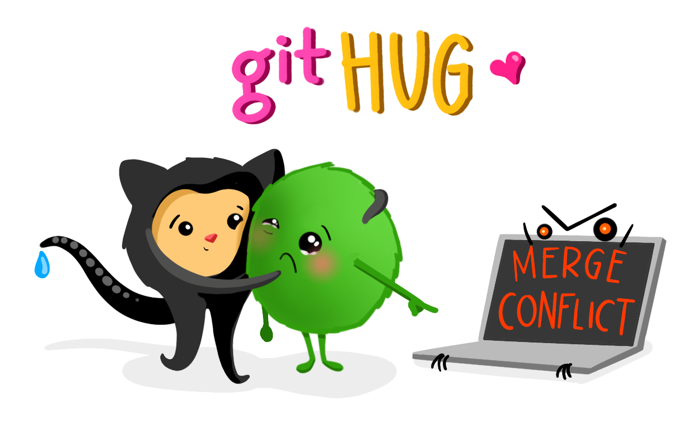\

::: callout-note
Git surge en 2005, tras la ruptura de la relación entre la comunidad que estaba desarrollando Linux y la empresa comercial que desarrollaba BitKeeper (DVCS). En ese momento BitKeeper dejó de ser gratuita y esto llevó a la comunidad de desarrolladores de Linux (y en particular a Linus Torvalds, el creador de Linux) a desarrollar su propia herramienta para el control de versiones basándose en su experiencia al utilizar BitKeeper.
:::

Git facilita el **trabajo en paralelo** de varios participantes. Mientras que en otros sistemas de control de versiones (p. ej. Subversion (SVN, <https://subversion.apache.org/>) o Concurrent Versions System (CVS, <http://cvs.nongnu.org/>)) hay un servidor central y cualquier cambio hecho por un usuario se sincroniza con este servidor y de ahí con el resto de usuarios, Git es un control de versiones distribuido que permite a todos los usuarios trabajar en el proyecto paralelamente e ir haciendo "capturas" del trabajo de cada uno para luego unirlos. Otras alternativas de control de versiones distribuido comparables a Git son Mercurial (<https://www.mercurial-scm.org/>) o Bazaar (<https://bazaar.canonical.com/>), pero Git es con diferencia el más utilizado.

{fig-align="center"}

## [Qué es GitHub](https://github.com/)

GitHub es un **servidor de alojamiento en línea** o repositorio remoto para albergar proyectos basados en Git que permite la colaboración entre diferentes usuarios o con uno mismo [@galeano2018; @perez-riverol2016]. Un **repositorio** es un directorio donde desarrollar un proyecto que contiene todos los archivos necesarios para el mismo. Aunque existen distintos repositorios remotos (p. ej. GitLab, <https://gitlab.com/>, o Bitbucket, <https://bitbucket.org/>) con funcionalidad similar, GitHub es hoy en día el más utilizado. GitHub registra el desarrollo de los proyectos de manera remota, permite compartir proyectos entre distintos usuarios y proporciona la seguridad de la nube entre otras funciones.

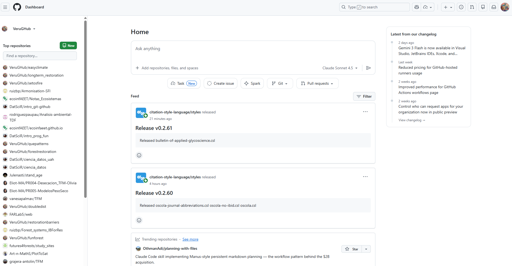

Cuando se trabaja en proyectos colaborativos, la base de la interacción entre Git y GitHub es que todos los colaboradores de un proyecto están de acuerdo en que GitHub contiene la copia principal del proyecto, es decir, GitHub contiene la **copia centralizada** del control de versiones distribuido o descentralizado.

# Instalación

## 📝 *Ejercicio*

En este punto es necesario que tengas instalada la versión más reciente de R (<https://cloud.r-project.org/>), RStudio (<https://www.rstudio.com/products/rstudio/download/>), Git (<https://happygitwithr.com/install-git.html>) y una cuenta en GitHub (<https://github.com/>) creada.

1.  Preséntate a Git ([Chapter 7: Git-Intro](https://happygitwithr.com/hello-git))

    ```{r config}
    #|eval: false  

    # install.packages("usethis")
    # library(usethis)
    #use_git_config(user.name = "Monchi", user.email = "monchi@example.org")
    ```

    ::: callout-important
    ⚡**Debes usar el correo electrónico asociado a tu cuenta de GitHub**
    :::

2.  En la terminal, compueba que has instalado Git correctamente:

    `git --version`

    Para ver el usuario utilizado para configurar Git:

    `git config user.name`

    Para ver a qué cuenta de correo está asociado Git:

    `git config user.email`

    Para ver tanto el usuario como el correo asociado:

    `git config --global --list`

3.  Genera un PAT (*Personal Access Token*) para HTTPS

    Git puede comunicarse con un servidor remoto utilizando uno de los dos protocolos: HTTPS o SSH. Nosotros utilzaremos HTTPS con *personal access token* (PAT, <https://happygitwithr.com/https-pat.html>).

```{r token}
#|eval: false  

# install.packages("gitcreds")
# library(gitcreds)
# create_github_token() # generar un token, elegir temporalidad
# gitcreds_set() # acceder al Git credential store
```

::: callout-tip
Conviene describir el propósito del token en el campo *Note*, porque se pueden tener varios PATs. No podrás volver a ver este token, así que no cierres ni salgas de la ventana del navegador hasta que almacenes el PAT localmente. ¡Trata este PAT como una contraseña!
:::

::: callout-tip
Para la resolución de problemas durante la instalación recomendamos mirar aquí: <https://happygitwithr.com/troubleshooting.html>
:::

# Repositorios y proyectos de RStudio

Un repositorio es como un "contenedor" donde desarrollar un proyecto.

Para crear un repositorio en GitHub damos a "*+ New repository*". Aquí se indica el nombre, una pequeña descripción, y si quieres que sea público o privado. Se recomienda iniciar el repositorio con un archivo "README" (*Initialize this repository with a README*) para recoger cualquier información esencial para el uso del repositorio (estructura, descripción más detallada del contenido, etc.).

En RStudio, creamos un nuevo proyecto y lo conectamos al repositorio: File \> New project \> Version control \> Git \> copiar el URL del repositorio que hemos creado de GitHub (está en la página principal de nuestro repositorio, en "*clone or download*"). Seleccionamos el directorio local donde queremos guardar el proyecto y pulsamos en "*Create project*".

Si vamos al directorio local seleccionado, encontraremos la carpeta conectada a Git y GitHub que hemos creado en nuestro ordenador. Podemos copiar aquí todos los archivos que nos interesan para el proyecto de análisis (datos, imágenes, etc).

::: callout-note
Para más información sobre cómo clonar el repositorio en GitHub (repositorio remoto) en nuestro ordenador (repositorio local) ver <https://happygitwithr.com/rstudio-git-github.html> para hacerlo desde RStudio y @galeano2018 para hacerlo mediante la línea de comandos.
:::

::: callout-note
En caso de querer conectar un antiguo proyecto de RStudio a Git y GitHub, puedes seguir los pasos que se describen aquí: <https://happygitwithr.com/existing-github-first.html>.
:::

## 📝 *Ejercicio*

1.  Crea un repositorio en GitHub y conéctalo a un nuevo proyecto de RStudio (esto generará un repositorio (carpeta) en tu ordenador en la ubicación que hayas especificado). Incluir un archivo "*.gitignore"*

2.  Crea un nuevo script de R en el directorio de trabajo (es decir, crea un script de R y guárdalo dentro del repositorio que has creado)

3.  En RStudio ve a la **pestaña Git** para ver todos los documentos que han sido identificados por Git

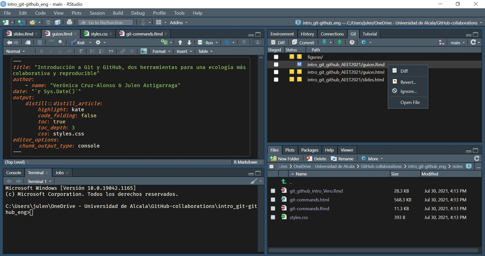

### Git ignore

Al crear un repositorio se recomienda crear un archivo "*.gitignore*". Este archivo contendrá los nombres o extensiones de los archivos del proyecto que por defecto no queremos compartir aunque estén en el repositorio local (p. ej., el archivo "*.Rhistory*" que RStudio crea por defecto). Es una buena práctica ignorar **archivos que no sean útiles para el resto de colaboradores así como archivos muy pesados** (p. ej., una base de datos resultado de correr un script) para no subirlos y descargarlos continuamente de GitHub. Para añadir archivos al *gitignore* se puede utilizar el botón derecho del ratón sobre el archivo en la pestaña Git de RStudio pero también se puede añadir el nombre del archivo que desamos ignorar en el archivo "*.gitignore*" manualmente.

#### 📝 *Ejercicio*

1.  Añade el archivo .Rproj de tu proyecto al archivo *.gitignore.*

2.  Crea una carpeta llamada "datos" en tu directorio de trabajo. Mira la pestaña de Git en RStudio. Añadela al *.gitignore* y guarda. ¿Qué ha pasado en la pestaña Git?

### Estructura del repositorio de GitHub

En la página principal del repositorio en GitHub ([ejemplo](https://github.com/VeruGHub/easyclimate)) podemos encontrar las siguientes pestañas:

-   **Code**: contenido del proyecto

-   **Issues**: foro del proyecto para comentar fallos, tareas pendientes, hacer peticiones a los desarrolladores, preguntar dudas, etc. Se pueden asignar tareas o preguntas a los miembros del proyecto escribiendo "\@" antes del nombre del colaborador. Una vez resuelto, el issue se cierra (*Close issue*).

-   **Pull requests**: permite unir diferentes ramas con diferentes versiones del proyecto.

-   **Actions**: son pequeñas aplicaciones que realizan alguna acción cada vez que se sube un commit (p. ej. tests).

-   **Projects**: es como una hoja de cálculo con tareas, encargados, deadlines, status, etc. que se integra con las incidencias y solicitudes de incorporación de cambios para ayudar a planificar las tareas y realizar el seguimiento del trabajo.

-   **Wiki**: es un espacio para documentar el proyecto (hoja de ruta, estado, documentación detallada...).

-   **Security**: opciones de seguridad.

-   **Insights**: estadísticas del proyecto.

-   **Settings**

# GitHub: la red social

GitHub no es sólo un repositorio remoto donde almacenar diferentes versiones de tu trabajo o desarrollar proyectos colaborativos, si no que también es una **red de encuentro para programadores**. Como en otras redes puedes cotillear perfiles, seguir a ciertas personas, tener seguidores, guardar proyectos que te gustan…

Con el buscador (🔍) puedes buscar aquellos contenidos que te interesan. La búsqueda está organizada por categorías (*Repositories, Commits, Issues, Users*…) lo que facilita encontrar lo que buscas. Para seguir a un usuario tienes la opción *Follow*. Pulsando *Star*⭐ puedes guardar un enlace a cualquier repositorio en tu cuenta de GitHub y con *Fork* estarías guardando una copia con la que puedes interaccionar. Con *Watch*👁️ puedes hacer un seguimiento de un repositorio. *Download* te permite guardar una copia de cualquier repositorio público en tu ordenador.

# Flujo de trabajo en Git y GitHub

Git es capaz de rastrear todos los archivos contenidos en un repositorio. Para comprender cómo Git registra los cambios y cómo podemos compartir dichos cambios con nuestros colaboradores es importante entender cómo se estructura Git y cómo se sincroniza con GitHub. Hay cuatro "zonas" de trabajo:

1.  **Directorio de trabajo (*working directory*):** es donde se está trabajando. Esta zona se sincroniza con los archivos locales del ordenador.

2.  **Área de preparación (*staging area* o *Index*):** es la zona intermedia entre el directorio de trabajo y el repositorio local de Git. Es la zona de borradores. El usuario debe seleccionar los archivos que se van a registrar en la siguiente "captura" de Git.

3.  **Repositorio local (*local repository* o *HEAD*):** es donde se registran todos los cambios capturados por Git en tu ordenador.

4.  **Repositorio remoto (*remote repository*):** es donde se registran todos los cambios capturados por Git en la nube (GitHub).


## ¿Cómo moverse de una zona a otra?

Se puede hacer mediante línea de comandos en la terminal y también mediante la pestaña integrada en RStudio, pero el proceso es el mismo.

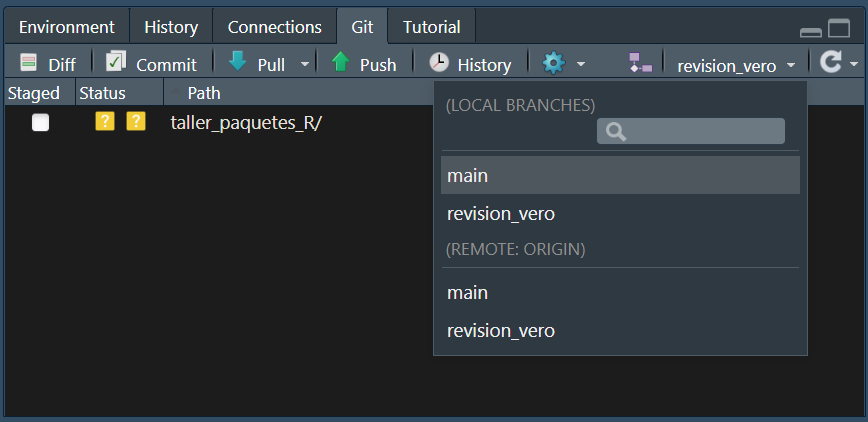{fig-align="center" width="486"}

Al principio todos los cambios realizados aparecen en amarillo porque Git no sabe que hacer con ellos. Estamos en el directorio de trabajo y puede que no nos interese guardar todos los cambios para el futuro.

Para añadir un cambio del directorio de trabajo al área de preparación hay que utilizar `git add` (en la pestaña Git de RStudio se hace seleccionando el archivo). Este comando indica a Git que se quieren incluir las actualizaciones de algún archivo en la próxima "captura" del proyecto y que Git las registre. Sin embargo, `git add` no afecta al repositorio local.

-   `git add <nombre de archivo>`: añade una actualización de algún archivo del directorio de trabajo al área de preparación.

Para registrar los cambios que nos interesen hay que utilizar `git commit` (en la pestaña Git de RStudio se hace clickando el botón "*Commit*"). Al ejecutar `git commit` se hace una "captura" del estado del proyecto. Junto con el *commit* se añade un mensaje con una pequeña explicación de los cambios realizados y por qué (p. ej. "incluyo las referencias formateadas"). Cada `git commit` tiene un SHA (*Secure Hash Algorithm*) que es un código alfanumérico que identifica inequívocamente ese *commit* (p. ej. 1d21fc3c33cxxc4aeb7823400b9c7c6bc2802be1). Parece difícil de entender, pero no te preocupes, sólo tienes que recordar los siete primeros dígitos 1d21fc3 😮(es broma). Con el SHA siempre se pueden ver los cambios que se hicieron en ese *commit* y volver a esa versión fácilmente.

-   `git commit -m "mensaje corto y descriptivo"`

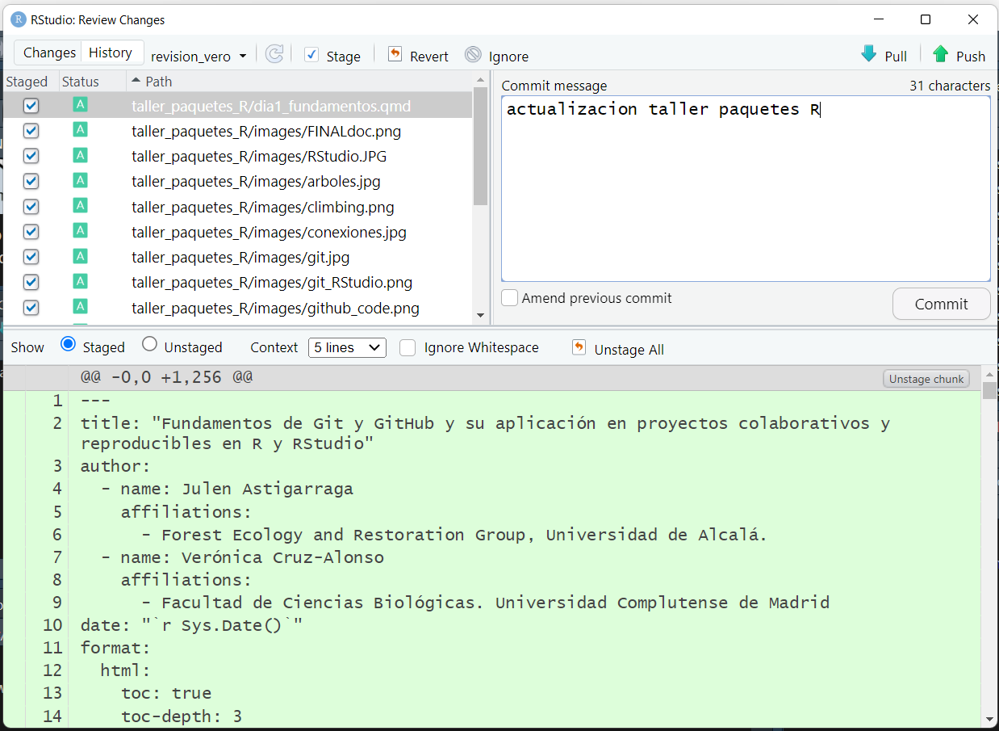{fig-align="center" width="545"}

::: callout-note
💡Usar `git commit` es para el proyecto como usar anclajes cuando estamos escalando una pared de roca. Desarrollar un script sin commits es como escalar sin asegurarse: puedes avanzar mucho más rápido a corto plazo, pero a largo plazo las probabilidades de fallo catastrófico son altas. Por otro lado, hacer muchos commits va a ralentizar tu progreso. Lo mejor: usar más commits cuando estás en un territorio incierto o peligroso.

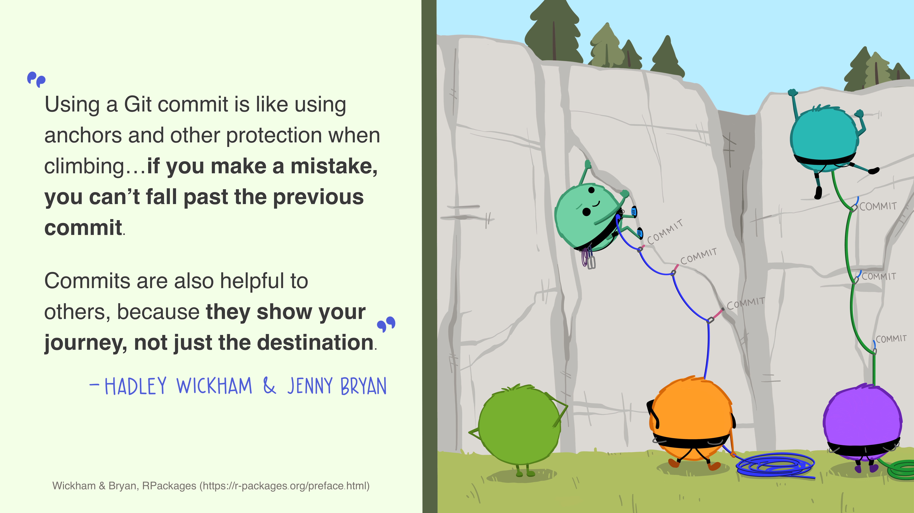
:::

Por último, `git push` permite subir los cambios que hemos hecho a GitHub y quedarán visibles para nuestros colaboradores (en la pestaña Git de RStudio se hace clickando el botón "*Push*"). Básicamente, `git commit` registra los cambios en el repositorio local y `git push` actualiza el repositorio remoto con los cambios y archivos asociados.

Cuando se retoma un proyecto tras horas, días o incluso meses, con `git pull` se descargan todas las actualizaciones que haya en GitHub (nuestras o de nuestros colaboradores), que se fusionarán (*merge*) con el último *commit* en nuestro repositorio local (en la pestaña Git de RStudio se hace clickando el botón "*Pull*").

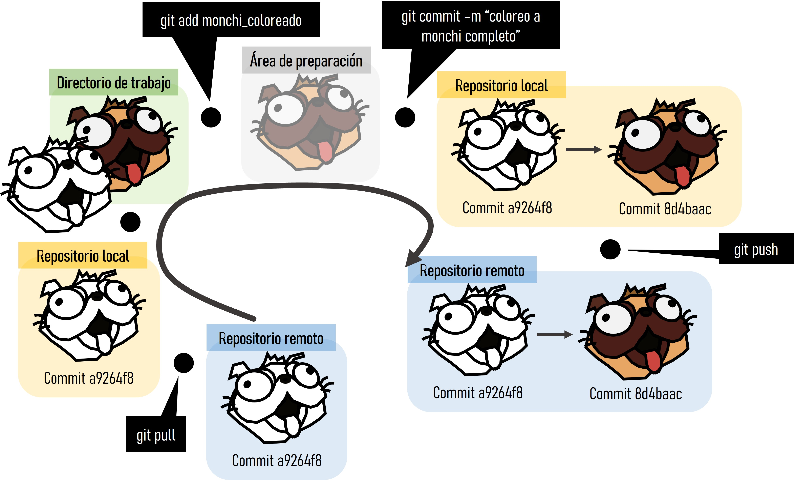

Además de los botones principales anteriormente descritos, en la pestaña Git de RStudio podemos observar el **botón "*Diff*"** que muestra los cambios que se han hecho a cada archivo desde el último commit y las **ramas** (que lo explicaremos más abajo). Clickando con el botón derecho del ratón podemos abrir los archivos que han sido modificados mediante **"*Open file*"** y con el botón **"*Revert*"** volvemos al estado del último commit (⚠️cuidado con esto porque te borrará los cambios realizados en tu directorio de trabajo).

## 🧩 *Ejercicio*

En el proyecto generado, guardad y subid los cambios realizados a GitHub (`git add` + `git commit` + `git push`)

::: callout-tip
`git status`: muestra la rama en la que estamos y los cambios hechos y añadidos desde el último commit.
:::

En el repositorio remoto de GitHub, en la pestaña *Code* podemos observar el contenido de nuestro proyecto, incluyendo cada *commit* realizado ([ejemplo](https://github.com/VeruGHub/easyclimate)).

## Navegar por el historial

El **historial de un repositorio** ([*🕘XX commits*](https://github.com/VeruGHub/easyclimate/commits/master/)) contiene una lista de enlaces a todos los commits que se han realizado en cualquiera de las ramas. Dentro de cada *commit* se pueden ver los archivos añadidos o borrados en esa "captura" y las líneas de código añadidas (en verde) o borradas (en rojo) en cada archivo modificado. Además, en el historial, se pueden añadir comentarios en líneas concretas de código o comentarios generales al *commit* entero.

En GitHub también se puede acceder a la **historia de commits de cada archivo** en concreto (*History*) y al autor de cada parte del código (*Blame*).

El historial del proyecto y de los archivos también es accesible a través de RStudio (🕒).

::: callout-note
Más información sobre como navegar en el pasado del proyecto aquí: <https://happygitwithr.com/time-travel-see-past.html>
:::

::: callout-tip
Si quiero volver atrás en el tiempo o si hago un cambio que no quiero ¿cómo lo puedo resolver? Hay múltiples opciones pero [aquí](https://github.com/DatSciR/intro_git-github/blob/main/centra/dia3_comandos.md) (en la sección de "La he liado ¿cómo deshago los cambios?") detallamos tres: *restore*, *reset* y *revert*.
:::

# Trabajo colaborativo

Aunque Git y GitHub facilitan el control de versiones de nuestros proyectos individuales, su máxima potencialidad se despliega al trabajar en equipo ya que facilitan el seguimiento del trabajo de todos los colaboradores y la integración ordenada de cada parte en un producto final.

Para dar **acceso** de edición a tus colaboradores, en la página principal de nuestro proyecto en GitHub entramos en "*Settings -\> Access -\> Collaborators -\> Manage Access -\> Add people*". Los colaboradores pueden crear su copia local del proyecto de control de versiones clonando el repositorio remoto como hemos hecho antes con nuestro propio repositorio.

## 🚀 Ramificación

Git permite crear una **rama (*branch*)** paralela al proyecto si se desea seguir una línea independiente de trabajo, bien por ser diferente de la principal (p. ej. probar un nuevo análisis) o bien para desarrollar específicamente una parte del proyecto (p. ej. trabajar sólo en la escritura de los métodos de un artículo mientras otros colaboradores trabajan en otras secciones). Las ramas permiten trabajar en el proyecto sin interferir con lo que están haciendo los compañeros. En Git, una rama es un *commit* al que se le da un nombre y que contiene un "enlace" (puntero o *pointer*) a un SHA específico que es el origen de la rama. La rama *main* es la rama por defecto cuando se crea un repositorio y a partir de ella se suelen crear las demás.

Las ramas [se pueden generar en la terminal](https://github.com/DatSciR/intro_git-github/blob/main/centra/dia2_colaboracion.md) y en la pestaña Git de RStudio. En la pestaña Git se generan mediante el botón "*New Branch*". Al lado de "*New Branch"* podemos observar todas las ramas que contiene el repositorio y nos permite cambiar de rama fácilmente clickando en ellas.

{fig-align="center"}

## ¿Cómo se unen distintas ramas?

Cuando el trabajo desarrollado en una rama se da por finalizado hay que hacer la **unión a la rama principal ("*main*")**. Esto [se puede hacer en la terminal](https://github.com/DatSciR/intro_git-github/blob/main/centra/dia2_colaboracion.md) y con el botón "*pull request*" en la página del repositorio en GitHub.


Una vez que hemos realizado los cambios que queríamos en la rama y están subidos a GitHub (`git add` + `git commit` + `git push`), en GitHub aparece la opción de "Compare & pull request". Aquí se genera el *pull request* ("*Create pull request*") añadiendo un mensaje para saber lo que se está uniendo. GitHub os indicará si existen conflictos o no. Si no existen conflictos, podréis realizar el *pull request* sin problema y, si existen conflictos, hay que resolverlos manualmente.

## Resolución de conflictos

Git puede encontrar conflictos al fusionar ramas que hay que arreglar manualmente (GitHub os indicará "Can't automatically merge"). Esto ocurrirá **si en las dos ramas se han cambiado las mismas líneas de un archivo**. Hay que generar el pull request y "*Resolve conflicts*".

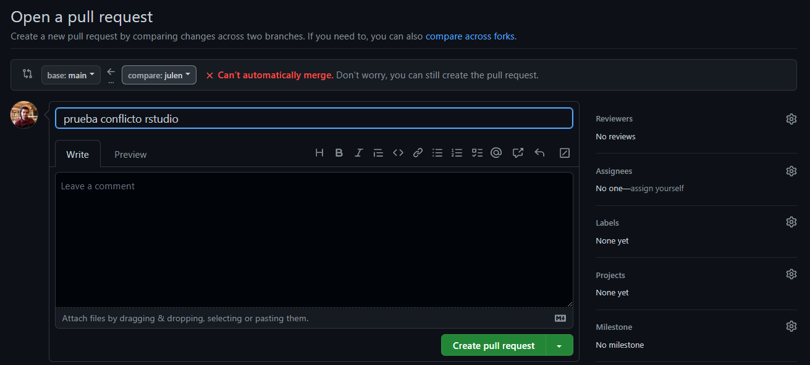

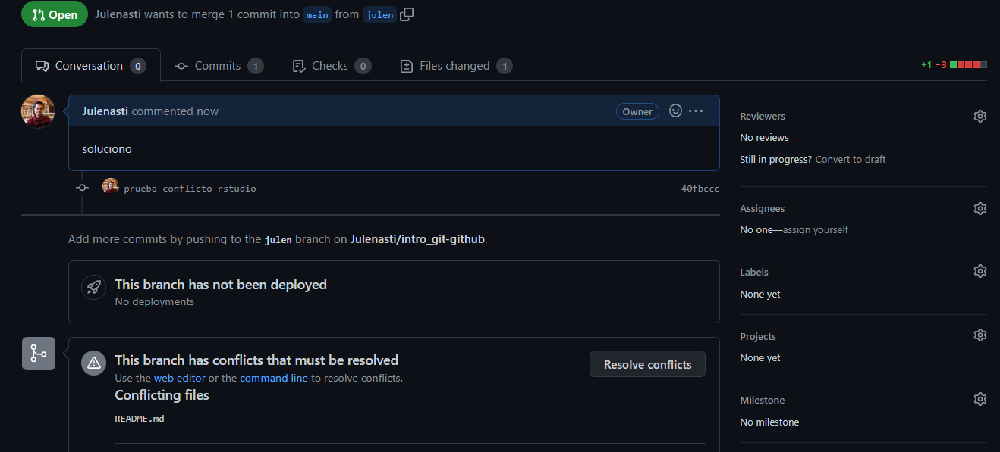

Git muestra dónde están los conflictos así:

`<<<<<<código del main=======código de la rama a unir>>>>>>`

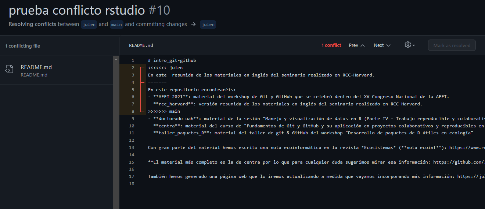

Para solucionarlo hay que **escoger los cambios** de la rama principal o de la rama a unir según corresponda. Una vez solucionados, Git permite completar el *merge* (es decir, un nuevo *commit* que contendrá las ramas fusionadas). La mejor manera de evitar conflictos o por lo menos reducir su dificultad es realizar cambios pequeños y sincronizar frecuentemente con GitHub, y tener una comunicación fluida con los colaboradores.

::: callout-note
[Aquí](https://github.com/DatSciR/intro_git-github/blob/main/centra/dia3_comandos.md) (en la sección de "Otros comandos útiles") podéis ver cómo borrar ramas que ya no se necesitan y otros comandos útiles
:::

# Algunos enlaces interesantes

-   [Ciencia reproducible: qué, por qué, cómo](https://github.com/ecoinfAEET/Reproducibilidad)

-   Curso: [Get started with Quarto workshop](https://jthomasmock.github.io/quarto-2hr-webinar/) (Tom Mock)

-   Curso: [Reproducible publishing with Quarto](https://mine-cetinkaya-rundel.github.io/quarto-jsm24/) (Mine Çetinkaya-Rundel)

-   [Manual de referencia de Git](https://git-scm.com/docs)

-   [Oh Shit, Git!?!](https://ohshitgit.com/)

-   [git - la guía sencilla](https://rogerdudler.github.io/git-guide/index.es.html)

-   [¡Se puede entender cómo funcionan Git y GitHub!](https://www.revistaecosistemas.net/index.php/ecosistemas/article/view/2332)

-   [Happy Git and GitHub for the useR](https://happygitwithr.com/)

-   [Ciencia reproducible y colaborativa con R, Git y GitHub (DatSciR)](https://github.com/DatSciR/intro_git-github/tree/main/centra)

# Referencias

::: {#refs}
:::

Y recordad:

{width="339"}
